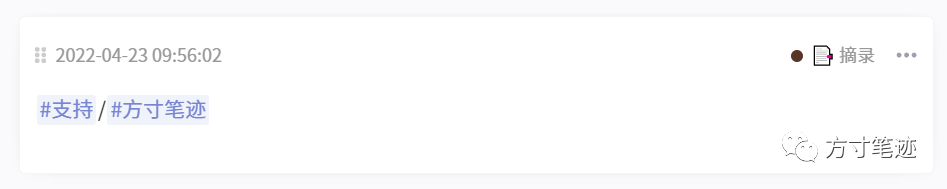
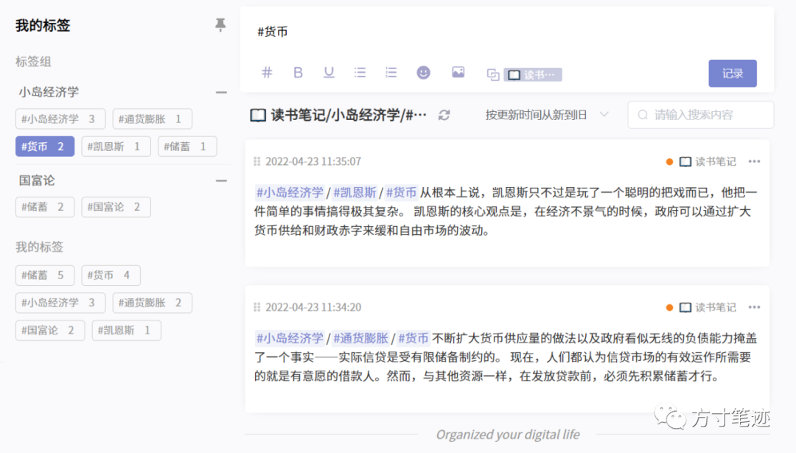

👋👋 Hello，各位小伙伴，方寸笔迹已经准备好了0.8版本，这会是在桌面端App完成之前的最后一个web端大版本，在桌面端出来之前，web端应该会保持当前的状态，持续做一些功能优化上的工作。

0.8版本是在之前的基础上，新增了**标签组功能**，修复了笔记数量统计相关的bug，优化了了笔记存储和展示的数据的稳定。

## 🏷️ 标签组功能介绍

标签组的概念是标签的组合，并不是单纯对标签的分组管理，因为仅仅是标签分组无法在复杂的场景中，提供最优的笔记检索方式。而标签的组合，顾名思义就是多个标签通过某种方式构成的笔记层面上的关联。

当你在输入#a-b（_方便部分用户的习惯，同时也兼容#a/b语法，出于对中文的友好，我们建议使用-连字符_）这种格式的标签语法时，系统会判定你输入的是标签的组合，会把#a跟#b形成组合关系，在检索时可以独立检索标签组合的笔记，过滤掉非组合关系中的其他笔记。

在绑定关系上，系统认为#a-b与#b-a是两种组合形式，#a-b组合建立时并不会同时反向建立#b-a的组合。对于#a-b-c这种形式，系统会认为是以#a为主体同时与#b、#c组合，是三个标签的组合形式，不存在#b、#c这种可推演出来的数学逻辑上的组合。也就是说，你在看到你创立的标签组时，你的标签组只有一层折叠展开效果，不会出现多层标签的嵌套。

图1 标签组录入

图2 标签组展示

当然，标签对应的笔记数统计也是按照组合来计算的。如果你的#a标签有10条笔记，#b有20条笔记，#a-b就会只统计两个标签组合的笔记数，跟原来的笔记数量有所区分，展示的笔记也只会展示标签组相关的笔记。

图3 标签组显示  

在标签组的功能设计之初，我也考虑到如果标签能够无限层级的组合，拓展性会更好。但落实到应用层面，无限层级所带来的仍然是无效，其实跟没有标签组合的效果是一样的，仍然无法有效地快速定位，那标签组的意义也仅仅是停在管理层面。

同样，如果还是沿用之前的展示效果的话，当标签过多的时候标签界面就会很乱，再加上组合关系就会更加无从下手。我思前想后决定折叠了标签板块，增加了折叠的中间栏，用作对标签和标签组的展示，置顶的标签仍然留在原来的位置作为标签的一级入口，便于日常使用。

我用做读书笔记来作为案例场景。

在用方寸笔迹记录读书笔记之前，我会先建立一个名为“读书笔记”的笔记本，我所有的读书过程中的摘录和思考都通过标签的方式做好标记，记录到笔记本中，便于在后面需要的时候随时调取。当然这是理想状态，通过笔记本和标签就能定位到笔记内容。但实际上呢，当我的笔记数量达到几百条时，数十个标签一打眼上去根本找不到想要的，标签机制所带来的快速检索效果就会失灵，找到笔记就成了一件费时费力的事情。

我最近在读《小岛经济学》，在我做读书笔记时通过标签组功能，就可以考虑按照组合的方式来建立好笔记库。我的标签格式如 #小岛经济学-通货膨胀-货币，系统就会按规则生成小岛经济学、通货膨胀、货币三个标签，并生成这三个标签的组合，记录到笔记本中，标签下的笔记数也会按照组合形式统计。

图4 使用效果

**_我会首先更新web端尝鲜，会在接下来的0.8.1更新H5端。_**

## 💻 接下来我们的工作方向

接下来方寸笔迹工作会以桌面端App为主，移动端App为辅。且不说能支持全端而又美观好用的桌面端笔记工具太少，我们更加考虑到速度和安全问题，毕竟做笔记最合适的输入工具就是电脑（这里有点个人主观判断）。要集中力量攻坚最为困难的部分，做好方寸笔迹最核心的特性，同时展开太多工作线会失去一定的目标感。

在这里我瞒着其他两位创建者，预先透露桌面端的两个特性。

一、方寸笔迹的桌面端会支持markdown。从安全性考虑，必须要把使用者自己的笔记能存在本地，使用者可以把自己的云端笔记拉到本地，本地编辑后再更新到云端，既安全又便捷，还能节省使用web端资源加载的时间，因此markdown就是最完美的方式，具体的实现以及与方寸笔迹的契合我们会进一步做研究。

二、方寸笔迹会在字数统计上进一步优化，把原本的字符统计方式，拆分成中文、英文、字符、段落的统计，让笔记内容显得更加立体。

我不能再说多了，桌面端的特性不仅如此，请大家耐心等待。

祝大家使用愉快~