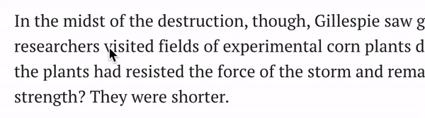
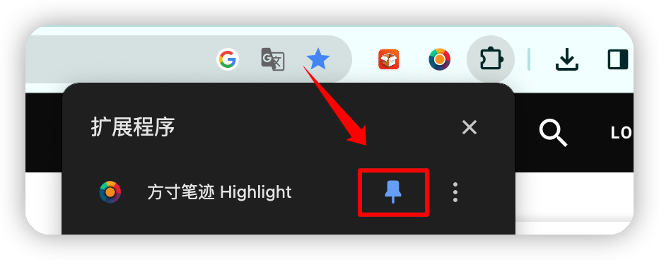
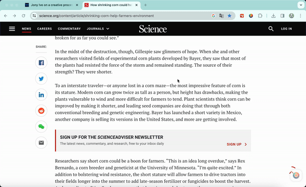

## 插件介绍

方寸笔迹Highlight是以方寸笔迹基础能力和账户体系为基座，为浏览器开发的一套独立的笔记系统，该系统包含了摘录和想法两部分。

用户通过对选中的网页文本直接交互，使得整个网页都是笔记交互的对象。

-   • 摘录：记录选中的文本；
    
-   • 想法：对选中文本的想法记录；
    
-   • 分享：通过memocard生成分享图片。
    

本插件脱离了为方寸笔迹引流的产品设计，为了用户体验开发了独立的tab页面，仅提供对插件产生数据的检索，专注于浏览器场景下的笔记功能。

## 开发原理

技术上我们是针对Blink、Webkit内核的主流了浏览器提供了安全的web代码注入，增加在每个页面上的文本交互功能。

插件会在安装时提示所获取的权限，我们的插件会在用户许可的授权内使用，越权的数据会被浏览器主动屏蔽。

在交互的时候，我们仍然是以方寸笔迹基础能力作为底座，因此在数据交互上仍然是与方寸笔迹通信，借助方寸笔迹的底层能力实现了本插件的能力。

## 如何使用

参考方寸笔迹安装说明完成安装之后，在页面上选中文字，就会在文字后弹出方寸笔迹的toolbar：

你应该也会发现，在网页右下角会有一个浮动的logo，点击后就可以看到刚刚做好的摘录和想法笔记。

你可以把把方寸笔迹插件固定到地址栏右侧，方便直接使用。

点击图标后，就会跳转到专为浏览器开发的笔记管理界面：

你可以在方寸笔迹公众号回复：**获取插件**，来获取下载地址。

如遇到问题，可以发送邮件 ivone@fang-cun.net  联系我，我会尽快帮你修复并给你答复。