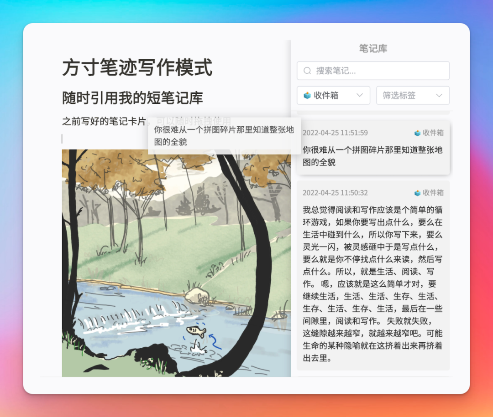

**👋** Hello 朋友们好，我们好久不见。

我们桌面端公测版本终于要跟大家见面了，这段时间开发组的小伙伴都天天被我催得抓耳挠腮，周末也没能安稳地休息在电脑前调试代码。期间我们还邀请了部分用户参与了内测版本的体验，为我们提出了非常多有价值的见解。在测试了几周后，终于做好了比较稳定的版本，现在邀请大家一起参与方寸笔迹桌面端的尝试。

言归正传，一起来看看方寸笔迹桌面端有啥新的功能。

**如果你不想了解，可以直接划到文末，了解公测启动时间，领取公测折扣🎁**

## 🎨 功能介绍

## 💻 数据本地化

你不用担心因为网络问题，使用方寸笔迹的时候等着转圈圈了。

我们现在把你云端的笔记，在你登录方寸笔迹桌面端之后，全部下载存储到你电脑上，无论有没有网络，你都能快速操作你的笔记。

## **📝** 写作模式

你有没有感受到，笔记卡片（短笔记）记录了一大堆之后，并没有书里说的那么方便，跟原来的笔记法一样，还是一堆笔记堆叠在那里。

或许你会用notion、words这类工具，定期把记录的卡片重新整理梳理，但，这要花费两倍的时间啊。

面对卡片跟写作的割裂状态，在方寸笔迹的写作模式中，增加了对卡片的直接拖拽引用，你能在梳理知识的时候随时把之前的卡片，以不打断的思考方式拖拽到你的写作内容中。

当然，还有能在写作中让你更加愉悦的纯Markdown所见即所得的文本编辑器、ctrl+v形式的图片粘贴、以及实时的写作大纲，让你能沉浸在写作中。

_ps：上图中的插画，文案是：Only dead fish go with the flow. A nice reminder to swim your own path in life and be true to yourself._

## **🧐** 新版知识图谱（近期推出）

既然在写作模式中增加了卡片的拖拽引用，那笔记间的引用关系，也能生成知识图谱吗？

🤗 当然可以

写作模式的直接引用，以及被引用卡片的本身存在的关系，会生成一张写作模式的知识网络，更方便地梳理写作中的逻辑关系。

## **📥** Markdown导入（近期推出）

既然方寸笔迹提供了纯Markdown的写作，那我能不能把我自己的Markdown文件导入方寸笔迹里面？

🤗 当然可以

方寸笔迹会按照固定的格式解析你上传的Markdown文件，实时融到方寸笔迹系统中，自动生成标签、图谱、大纲 … 并且以方寸笔迹的同步能力，同步到多端使用。

## **💾** Markdown实时转出（近期推出）

同时，方寸笔迹也会给你存储在本地的笔记，实时转录出Markdown文件，你可以使用你的同步盘再次同步你的笔记。

## **🥳** 公测折扣

公测版本将于**2022-07-22**开始，具体时间会在方寸笔迹群中发出公告，配合桌面端上线，方寸笔迹开售永久会员权益，永久会员定价**￥399**，将会永远有效使用方寸笔迹的新版本、新服务、新功能，并且可优先体验尚未正式发布的新版本和实验室功能。**_另外，方寸笔迹无论付费还是免费版，都不会有广告。_**

在公测期间，你可以扫下方的二维码领取永久会员的**399-100**优惠券，以及年度会员满**138-40**折扣券，来购买方寸笔迹的pro权益，你的一点点支持是我们持续迭代更新的动力。优惠券截止使用时间：**2022-08-07，逾期作废。**

_注：永久会员权益有效时长100年，从支付完成后时开始计算，后推_100_年，如果早已购买年度会员，则在_100_年基础上增加原有的时长。_

_如有问题，可以随时联系 ivone@fang-cun.net，或者在公众号回复“__**社群**__”加入我们的交流群中来。  
_