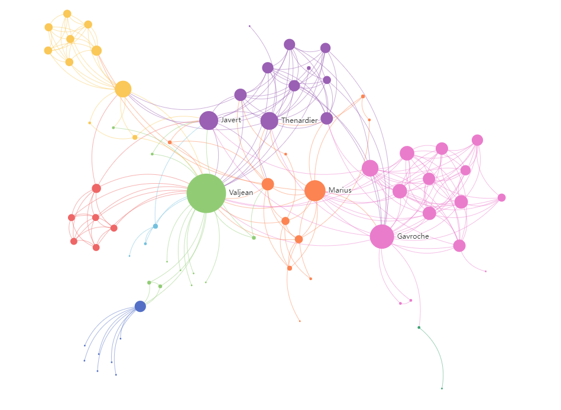

我在跟小伙伴聊天的时候，经常会听到一句话

> “你说的内容已经触及到了我的知识盲区”。

接下来聊天对话就中断了，即便是你有再多的想法和要表达的内容，都瞬间因为这句话，给粉碎地无影无踪，深度交流到此结束。对方一脸无辜，而你却深受打击。

简单分析这种场景，其中包含了两个层面的信息。

-   所谓的知识盲区是什么？
-   如何解局？

**·· 从记忆方式开始说起 ··**

我们在学习知识的时候，大脑的存储方式，并不会因为学科的区分，而产生知识的分别，大脑在记忆过程中都是以神经元关联的方式产生记忆，不存在按场景产生不同的记忆方式。不同学科的知识，在大脑不同区域的神经元组织中，内部关系复杂，外部关系简单。

你是否有过一种感觉，就是你在读书和学习中，因为书中的某一句话，有一种恍然大悟的感觉，好像是问题在一瞬间变得明朗，冥思苦索的思路被贯通。

这就是你大脑经过你对这句话的思考，不同知识的神经元产生了联系，两块知识区域被打通，从一个点就可以层层关联起更多的知识，这就是你恍然大悟的原因。

遗忘也一样，人脑并不像计算机硬盘那样，写入数据后就能永久存储。人脑对于长时间用不到的知识，就会在你不知不觉中丢弃。丢弃知识就相当于断开神经元之间的联系。而对于一直在用的知识，其神经元之间的关联会更加深入和复杂，在知识提取时变得非常灵活。

艾宾浩斯遗忘曲线  

而这知识的关系网络，仅仅是存在与你的大脑中，你并不清楚具体的边界在哪里，具体的关系是怎样的，只有在我们听到或是看到某个关键词的时候，大脑才会开始启动检索并输出相应的判断结果，然而这一系列的关系、层级和判断过程，都无法显性化得知。特别是对于那些处在边缘的即将被遗忘的知识，究竟有哪些，也没有有效的提示，如果没能做到每日都花时间回顾和思考，遗忘的效应就会非常可怕。

**·· 可视化知识网络 ··**

因此，方寸笔迹提供一种将知识图谱具象化的能力，在你读书、学习过程中，势必会对某些较为重要的内容做记录。如果是简单对重点标红，其实一点意义也没有 ---- 知识不会因为你标红了就会进入你的大脑并产生知识关联，你要做的，是要花费大量的时间做思考和记录，所谓不动笔墨不读书，只有动手了，才会对其中内容进行深度的思考。方寸笔迹提供将基础的阅读、思考片段的永久记录的功能，便于你在任何场景下进行永久性的片段存储。你可以记录下你看到的一句话、一段文字和你想到的一件事情。下一步，在你空闲时，对刚刚的记录，进行关键词的摘取，形成关键词的索引关系，方便通过某一个关键词，能够快速检索出相应的知识记录。当一个笔记片段中存在多个关键词的时候，关键词之间就产生了关联，就如同只是在大脑的关联一样，慢慢地形成了一个网状的知识图谱。

悲惨世界人物关系网络图

每一条笔记都是一个知识节点，随着学习的深入笔记的增多，每条笔记之间零散的、无序的知识点必须逐渐演化为层次性的知识网络，才能被有效地检索和利用。

那么，回归到一开始的问题，知识盲区是什么？知识盲区是你通过可视化的知识网络，发现的尚未学习到的知识，或者说是在你知识图谱边界外的内容。当你建立起了自己的知识图谱，那找到边界自然是轻而易举的事情，在你发现了边界之后，去探索边界的知识也更加容易，也能轻易地找到即将要忘记的知识和没有产生“恍然大悟”的孤岛。

不要过度地相信大脑的记忆能力，保持持续的知识关联和笔记记录，才能做到最有效的记忆，而方寸笔迹能在这里为你辅助提供有效的知识管理，为你的知识积累提供高效的检索。

**文献参考**

- _连接式建构:知识建构研究的新取向 （万海鹏，余胜泉，王琦）- 电化教育研究 2021.10_
- 碎片化信息的个人存储和管理（曾哲） - 电脑知识与技术 2020.08
- 知识库中的概念网络构造研究（智慧来，智东杰，刘宗田） - 计算机工程与应用 2009
- 大脑学习与记忆机制的研究进展（王忠明） - 生物学教学 2004.03