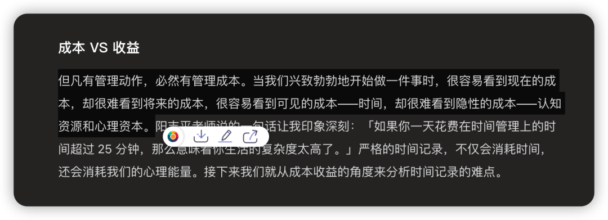
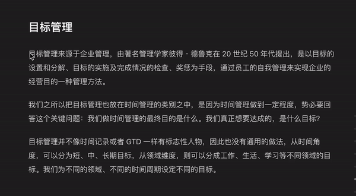
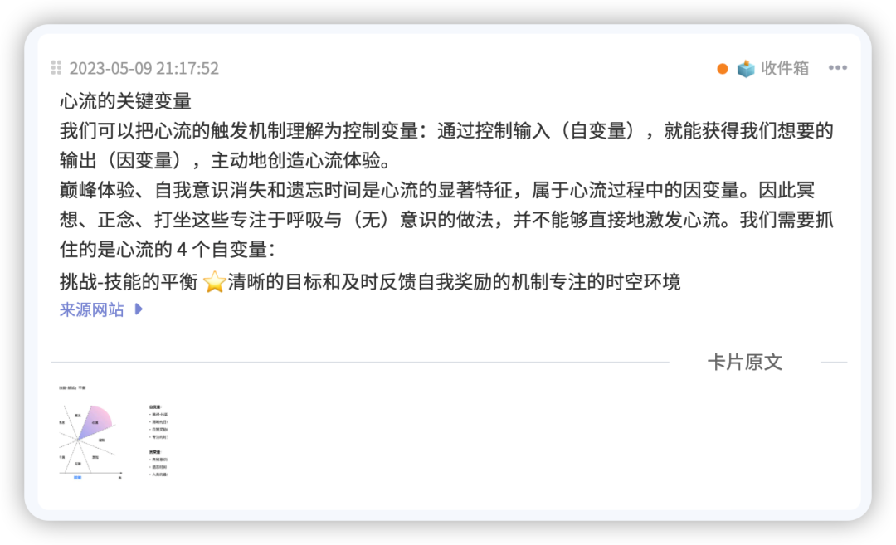
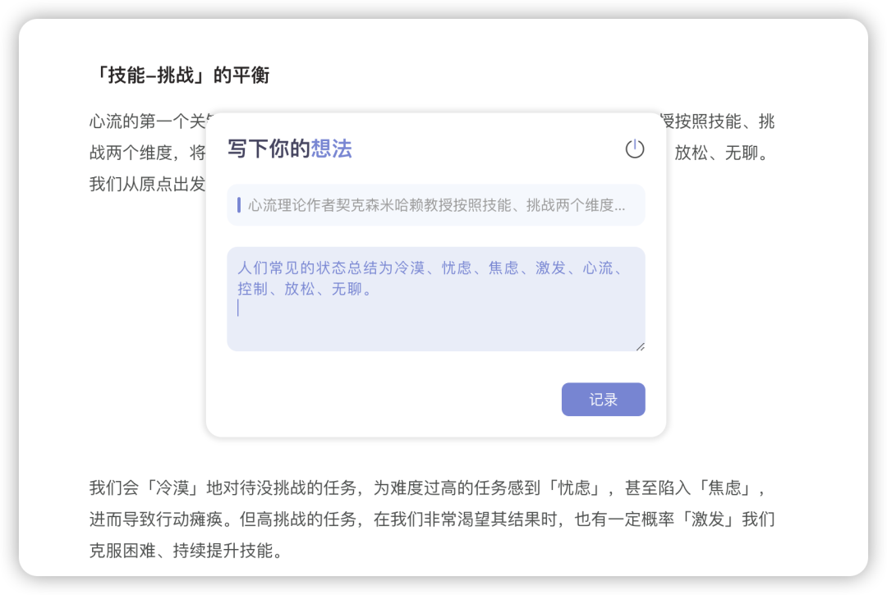
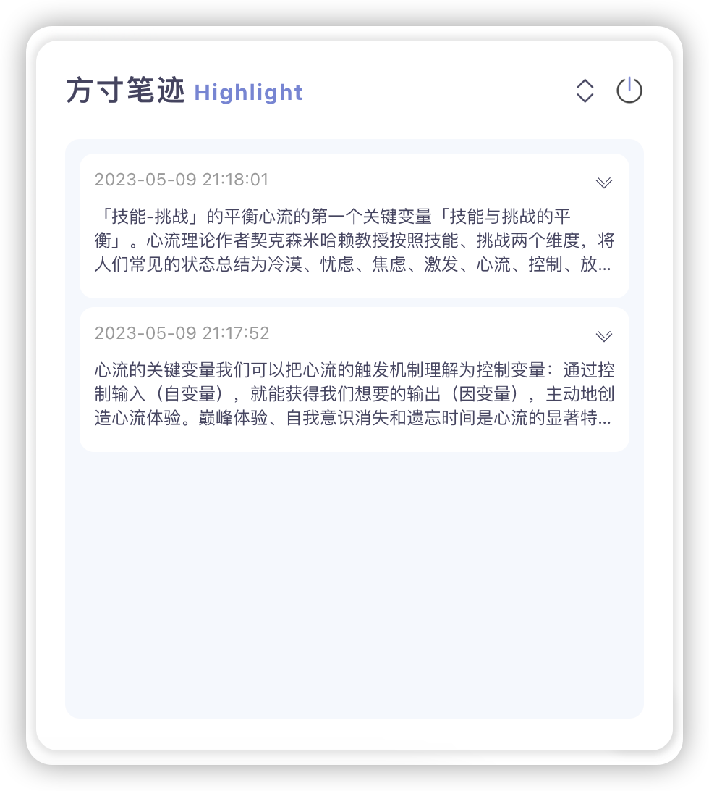
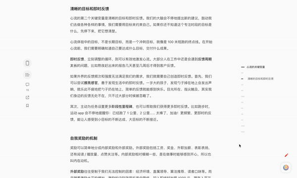
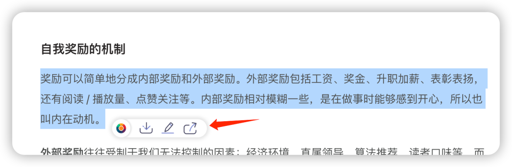
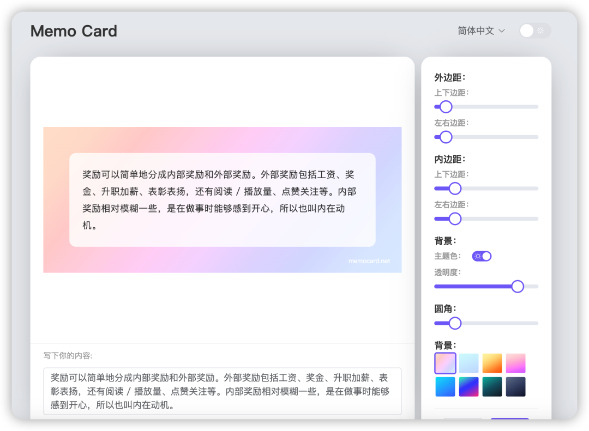

不知道你在网页阅读的时候，特别是读到一段比较受用的内容，有没有特别想用马克笔在屏幕上做高亮，或者记录下对于这段文本的思考？

然而，现有的解决方案，除了剪藏整个网页，或者说打断阅读手动复制内容到笔记工具里面，没有在阅读既不打断阅读，又能在上下文中方便摘录的工具。面对一天内大量的网页阅读，实在是无奈。后续的要利用起当前页面的记录，找起来也很困难，一个关键词搜出一大堆不知从哪里来的记录，让整理起来成本也变得很麻烦。

在网页阅读的场景中，剪藏确实很有用，万一网页找不到呢，万一页面404了呢，面向处理文本结果来说剪藏的确是最优解，但阅读的过程中，剪藏就失去了势，不能随着用户阅读的进度做阶段性的整理。

在上述场景中，我们团队做了一系列的工作（可见上篇：[我们确实是销声匿迹了一段时间](http://mp.weixin.qq.com/s?__biz=MzkyMTI3MTUwOA==&mid=2247483934&idx=1&sn=fc6d117cf9cf40c648df84194c725c8c&chksm=c1876fa5f6f0e6b32a0412c27aaf1a0e3e60d33b24bd5a2ede111c0ee3904f211a2eced1e46a&scene=21#wechat_redirect)），开发了全新的浏览器插件来满足阅读过程中的难题。

## 选中即可摘录

阅读中光标选中内容后，随着选中内容的末端，出现文本操作的选项。可以实现全部选中文本、图片的摘录，如果你有方寸笔迹账户，可以实时同步，如果没有也不影响正常记录，只是会影响多端笔记的同步。

## 记录想法

## 回顾

当你再次回顾当前网站的时候，通过页面右下角的浮窗，就能快速找到之前的所有文本摘录和想法。

## 分享

如果你想把这段文字分享到微博、朋友圈等等社交平台，memocard就派上了用场，可以把你的文字转换成卡片图片，你分享的文字就会比别人的更精美。

## 上线时间

目前本插件已经邀请了部分用户参与测试，计划于本月下旬发布公测，如有兴趣参与测试可以扫码添加下方微信获取插件。

