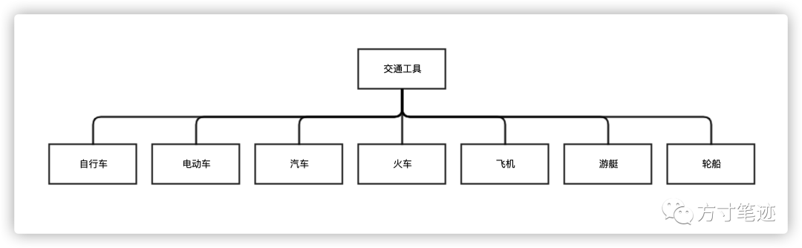
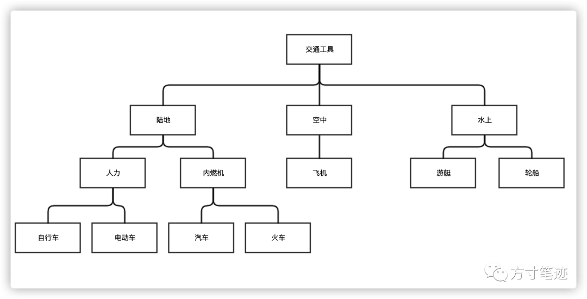

上文提到了建立知识网络的意义，本文我们接着来聊聊如何来构建个人的知识网络。

**上期推文：** 链接

知识网络这个词是不可分割的，不能轻易地拆解成知识和网络两个词语来理解，知识网络是你大脑中知识的点线结构，不同的知识点通过连结形成相互关联的知识网，在你需要某一个知识点的时候，大脑会为你准备好与知识点相关的所有知识结构化的支撑，无论是发散性思维还是聚合型思维，都需要有层级结构的知识网络。

这里又出现了新的概念：结构化知识。我引用莫雷教授的解释

> 所谓结构化，是指将逐渐积累起来的知识加以归纳和整理，使之条理化、纲领化，做到纲举目张。知识是逐渐积累的，但在头脑中不应该是堆积的。心理学研究已发现，优生和差生的知识组织存在明显差异。优生头脑中的知识是有组织、有系统的，知识点按层次排列，而且知识点之间有内在联系，具有结构层次性。而差生头脑中的知识则水平排列，是零散和孤立的。结构化对知识学习具有重要作用，因为当知识以一种层次网络结构的方式进行储存时，可以大大提高知识应用时的检索效率。
> 
> 莫雷．教育心理学：教育科学出版社，2007年

因此，结构化就不仅仅要把知识形成平面的网络，更重要的是要形成立体的网络，在每一个知识点背后，都有多种结构进行支撑，下图是非结构化知识的存储形式。

图1：非结构化知识

可见，所有的知识点都通过交通工具一个关键词能检索到，然而检索到的知识并没有某些特殊的标识或是属性，对大脑而言也仅仅是能记录下必要的知识，并不能将知识有效的归纳，形成条理化的存储。一旦离开了交通工具关键词的检索的依赖，就形成了许多游离的知识，相互之间不存在关联，当换一个词的时候，可以依赖于大脑的容错机制，来找到相应的知识，但这毕竟是基于容错机制，只要是绕过了容错机制，你的知识就是一团无效的记录。  

下图是结构化知识的存储形式

图2：结构化知识

可见通过交通工具检索出来的知识，已经被归纳成陆地、空中和水上三种交通工具，而陆地交通工具又是可分为人力型交通工具和内燃机型交通工具。显然比起图1来说，更加条理和明晰，其知识点的串联关系更加详细具体，撇开交通工具关键词，其他关键词依然能通过知识网络发挥作用。

方寸笔迹在形成知识图谱的时候，会遍历所有层级的关键词形成完整的知识图谱和结构化知识网络。罗马城不是一天建立的，知识的积累和结构化网络必然也不是一朝一夕就能形成的，需要反复的思考和学习，将阅读片段、思考片段积累下来，用一种永远不会丢失的方式，建立起自己的知识护安全城河。

人类过去任何一个历史时期都无法比拟现代社会的信息量。在微量信息时代，信息过剩，如何通过软件辅助存储和管理大脑信息是一个迫切需要解决的问题。虽然各个网站收藏夹能起到一定的存储和管理作用，但将阅读的信息分散到各个网站收藏夹，调用速度较慢，而且有时很难回想具体是在哪个网站进行的收藏，所以需要专门的软件去汇总自己阅读的信息。信息管理软件因此需求孕育而生，其起到存储和提取的作用，统筹管理各种信息。

方寸笔迹的产品设计过程中，每个关键词都是在模拟大脑记忆单元，其类似于将获取的信息存储于大脑的神经网络中；人的回想是从大脑记忆单元提取信息，相当于方寸笔迹通过关键词来提取信息。通过上述对比可以看到，方寸笔迹能起到类似大脑存取信息的作用，可以说是人的第二大脑。

**Reference**
- 曾哲 2020 碎片化信息的个人存储和管理[J]