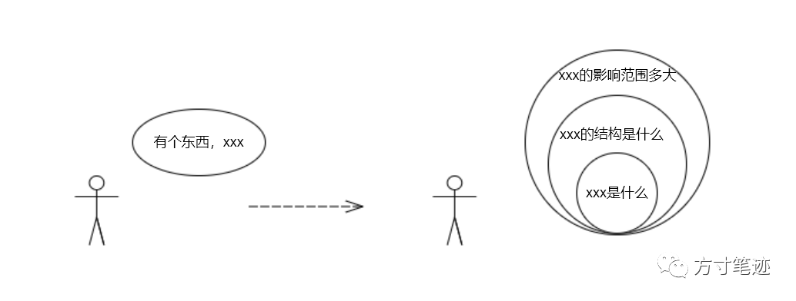

方寸笔迹的设计初衷，是依赖于两个基本的假设：1、每个人都在被动地接收碎片信息，2、碎片化信息需要进一步地转化。

展开来说，我们每天都会接触到非常多的信息，现在网络中最不缺少的就是信息，短视频、公众号、直播等等，通过移动设备非常容易触及。但是，对信息的归类和处理每个人都有不同的原则和方法，就会使得面对同样的信息不同人就有不同的解读语言，同样的信息就出现了层级化的价值分布。

而当你想描述在信息中事物是什么样子、什么味道、怎么用、用起来效果怎么样 … 的时候，要先从外界摄入足量的信息，才能说得清。也就是，面对知识的习得，知识的形成主要是来源于外界的信息，无论是由别人决定的还是先验的，我们所做的就是在从外界不断地下载。

早在2003年就有学者提出了以构建论为主体的学习方法。[1][2]

> 人的行为并不是直接对现实的物理世界进行反应，而是受到了一系列基于社会文化情境形成的工具的调节。

信息的波纹效应会在群体中被放大，我们会从众地阅读很多文字、跟风许多声音。在潜意识里面，我们是渴望能与身边的人就一件事情有共同的话题，保持一致的想法，从而被他人认可更好地融入到群体中，但忽视了信息对自身的必要性和可靠性的甄别，或者是在社会影响下故意保留自己的看法。类似的信息边界和价值取向，又进一步加固了内部逻辑自洽群体的护城河。从这个意义来讲，知识的学习并非是简单的刺激—反应的模式，而是集思考、反思、操作、实践、分享等相互整合的社会层面的建构意义的过程。我们会在乎他人眼里的事物的模样，也会模仿他人的习惯，学着别人的样子 … 对事物的整体认识会在不知不觉间形成了神经记忆。

因此，由外部环境影响的学习方式，看上去更加丰富和复杂，念课本时起码我们知道自己在学什么，学到什么状态算是完成；被动地学习就是把自己放在不同的群体中，接收毫无目的的信息。就好比玩游戏一样，你是在按照游戏公司所设定的路线闯关、完成任务，但你永远不知道你心目中的结局是怎样的，只有不断地寻找攻略探索地图，完成了无数支线任务之后，才会产生对游戏内容的认识。从这个意义来说，被动地学习更像是一个建立「链接」的过程，从一个关键词链接到一段信息，从一段信息链接到另一段信息，慢慢地拼凑起游戏的故事背景和各种系统设定，用被动积累起来的知识去面对游戏中尚未探索的区域。

**茧房式被动学习**

有可能你会认为我是偷换了「信息茧房」的概念：固定的群组、同质化的信息、类似的思维方式 … 的确有信息茧房的味道，但被动学习中依然是有主动的轨迹可循，信息茧房则是把自己的时间和思考能力拱手让给他人，由他人来替你做出是否接收信息的决策。

在刘瑜的一段采访中[3]，提到了信息茧房。

> 真正的信息茧房不是来自于信息的一元化，而是很容易在网络上找到心理支持网络，从而让自己变得过度自信。

前几天我读了一篇关于信息质量的文章\[4\]，作者提到了他的IPO模型（Input - Process - Output）以及信息质量公式

> 信息质量 = 信息密度 x 认知体系

从这个公式中和模型中，不难看出信息质量是由外界的信息密度和自身的认知体系所结合产生的化合反应，是通过信息的输入来不断地更新对事物的认识。

在信息茧房里面，并没有通过信息的不断输入来拓展认知体系的边界，这时IPO模型就不再适用，而转变成了OPI模型（Output - Process - Input），输入内容是被限制住框定好的，即便是有着高密度信息来源，在经过认知体系的一层过滤后，就只剩下了过滤后的残渣。就如同查理芒格所说：拿锤子的人看什么都像是钉子，你读到所有信息，都是戴上有色眼镜过滤后的内容。

刘瑜讲到她的摆脱信息茧房的方法，就是找到阵营里最优秀的人，关注他们的观点，摄取同类的信息，与最优秀的人形成群体的认可。

**探索式被动学习**

在被动学习中最重要的还是要把手里仅有的锤子，延展出更多的思维工具。今年初我在做研究的时候，我深深陷入了信息过载当中：由于我的研究对象内容过于广泛，我加入了很多社群、检索了非常多的研究报告，经常被读到的内容和新的概念牵着鼻子走，觉得有遗漏就表示自己本领不到家，就把认为有用的片段一条条收藏到方寸笔迹里面。最后回过头来发现在细枝末节上花费了很多本应该做主线研究的精力，片段和理论倒是记录了不少，但主线的研究并没有多少进度。

后来我把问题和状态调整了一番，总结出一个方法：把每个接触到的事物都划分为三个层级，即：

1.  概念
    
2.  结构
    
3.  范围
    

我有多种渠道从外界获取各类信息，遇到了新的事物、见解，就会先去了解事物是什么，作为事物的概念标签关系丢到方寸笔迹中，然后是结构、范围，就会形成一组带有组合关系的标签\[5\]。当我后面回顾的时候，我可以直接调取这层组合，就能快速定位到对应的事物，很快就能回顾起事物的全貌，无需再次查找。

赫胥黎有一句被说烂了的名言

> 时间最不偏私，给任何人都是二十四小时；时间也最偏私，给任何人都不是二十四小时。

就如我之前不断地被动延伸信息，既没有形成结构化的认识，也没有完成研究工作，就如同在沙滩上玩捡贝壳一样，每捡到一片贝壳就朝着这个方向继续前进，一段时间后回头看，就已经忘了自己是在哪里出发的，而这种方法所带来的就是在相同的时间里面，最低效的使用方法，你花二十四小时完成，别人可能四个小时就能完成。

我最近读了xdit尚未出版的《打造超人学习》[6]原稿，他提到了一个非常有用的学习方法：西瓜都是从中间开始切的。

> 你會發現，我們如果不先學「程序性知識」，先學一卡車「事實性知識」、「概念性知識」、「元認知知識」，似乎沒有什麼屁用，通常回家還是做不出來牛排，接著過沒幾個禮拜，甚至又把這些東希望得乾乾淨淨。但是，如果我們先學「程序性知識」，因為記得那種「感覺」，後續的「事實性知識」以及「概念性知識」，反而比較好黏附在上面。因為「跟你的目標相關」、跟「之前學習的流程」相關。

作者认为如果从事情的过程开始做起，先不用去理解事物的概念和事实，对整件事情的流程有所认识，然后在流程的对应节点上挂载相应的概念性、实时性知识，则会会让学习更加有趣味。作者用煎牛排举的例子，先按照老师教的内容：铁板的温度、什么火候要翻面等等过程自己先煎一遍，要比从头学习选牛肉、学理论要合理得多，到了需要的时候，再学习相应的知识挂载到流程的节点上。

**内在工具 & 外在工具**

因此，在被动学习的内核中是有一套处理信息的自动化工具，这套工具会帮你把接收到的信息构建成行为和记忆。

项飙博士也提到过这个工具[7]

> 这个工具不是外在的，像一台电脑或者手机，我可以给你；而是要放到他们脑子里面，由他们自己去处理、去发挥。他们也一定要改造这个工具，或者在不适用的时候把这工具完全抛掉，再造一个。

在信息茧房中，处理外界信息的工具仅仅是无需思考的来自潜意识的认知体系，这个工具会控制你刷下一条信息或者继续停留在这里。在被动的环境中，你行动所隐含的的假设都在与某个特定环境相关，一旦换了环境就会出现截然不同的行动，只要细心观察就会发现方法与行动之间的割裂，没有统一标准的方法能应用到具体的问题里面。

当内在的工具无法衡量的时候，你可以尝试求助于外部的工具，就如同上文中我在研究中发现的问题，内在的工具无法有效地记忆太多来自于外界碎片化的信息，那就把结构化的记忆外包给方寸笔迹，借助外部的工具来实现知识的结构化存储，内在的工具只需要建立好知识之间的链接，就能更高效地实现两个工具1+1>2的效果。

然而，外界的工具也会带来内在工具的升级，从使用者的角度来看，工具的效果是双向的，外界工具的设计理念和内在哲学，会在使用中潜移默化影响使用者的内在工具。不知道从什么时候开始，大家喜欢把一些笔记产品称为「数字花园」，我在L先生《分享我的生活管理系统》[8]中读到了对数字花园的解释

> 简而言之，它的含义是，建立一个笔记库（数字花园），把每一个想法、念头、信息，看作一颗种子，去悉心照料它们，嫁接它们，让它们长出新的枝条、结出果实，与别人分享。

在我看来，一款产品能被称为外在工具或者「数字花园」，自然是与使用者内在的工具（例如：IPO模型）所契合的，如果存在较大的落差，即便是再优秀的产品也无法与使用者匹配，毫无用武之地。接项飙博士对工具的解释

> 你一定要带入你个人的经验，否则其它东西都是飘着的。理解世界必须要通过自己的切身体会。

也如同方寸笔迹白皮书[9]中提到的，

> 由于用户的某些个性化需求无法满足，用户通常都会选择多个笔记工具来组合使用，以满足自身做笔记的需要。从边际效应递减规律可知，用户的工具组合是存在管理上限的，也就是超过一定的工具数量，知识和信息会过于分散，增加用户的管理成本，反而效率更低。

所以说，外部工具所带来的同样也是一种被动状态下的学习，产品往往会通过无形的引导培养起使用者的习惯，使用者通过习惯的获得去改造内部的工具，形成相得益彰的效果。再回到开头的方寸笔迹的设计假设，碎片化的信息获取，我想，仅凭大脑的记忆是完全做不到的，你需要有信息的中转。《增长黑客》作者范冰在他播客[10]中也提到：为了过滤Twitter中的垃圾推文，他专门开发了一个人工智能程序每天来做信息的中转，以求获取更大浓度的信息，提高摄取信息的质量。

**结语**

你可以说，你每天在被动接收无数的信息，这句话也可以说成是你在主动探索信息。你被动接收的是信息的广度，而你所探索的是信息的深度。

**延伸阅读**

_\[1\]. 伍新春，季娇，曾筝，谢娟，尚修芹，胡艳蕊．(2010) ．科技场馆学习中社会互动的特征及影响因素．首都师范大学学报：社会科学版，(5)，79-83．_

_\[2\]. Anderson,D.,Lucas,K.B.,& Ginns,I.S.(2003).Theoretical perspectives on learning in an informal setting. Journal of Research in Science Teaching,40(2),177-199._

_\[3\]. 刘瑜：最大的独立思考是设定自己的思想议程，[https://www.bilibili.com/video/BV1Gz4y1S7j3](https://www.bilibili.com/video/BV1Gz4y1S7j3)_

_\[4\]. 自由基，聊聊信息质量，_[_https://mp.weixin.qq.com/s/1yPQPjwQwD6HZoSTx103-g_](https://mp.weixin.qq.com/s?__biz=MzI1NDEyNTc2NA==&mid=2650453444&idx=1&sn=b0ff83add18488877785b8963eff2774&scene=21#wechat_redirect)_5_

_\[5\]. 方寸笔迹标签组合，[https://help.fangcun.in/help/group.html](https://help.fangcun.in/help/group.html)_

_\[6\]. xdite，打造超人學習，_[_https://github.com/xdite/learn-hack_](https://github.com/xdite/learn-hack)

_\[7\]. 项飙,吴琦， 把自己作为方法，_[_https://book.douban.com/subject/35092383/_](https://book.douban.com/subject/35092383/)

_\[8\]. L先生说，分享我的生活管理系统，_[_https://mp.weixin.qq.com/s/iR9UrlKZU81NFqKqkE6qTw_](https://mp.weixin.qq.com/s?__biz=MzAxNTY0NjEzNg==&mid=2247486010&idx=1&sn=ffabb2f5bc27276e1045f4f2a5c595f8&scene=21#wechat_redirect)

_\[9\]. 刘一峰，方寸笔迹白皮书，_[_https://mp.weixin.qq.com/s/X8G\_nVBFKsCIUetCuIW2UA_](https://mp.weixin.qq.com/s?__biz=MzkyMTI3MTUwOA==&mid=2247483848&idx=1&sn=a7da69619222d3d0bcf98397a8b19809&scene=21#wechat_redirect)

_\[10\]. 「把自己当成产品」，那如何打造产品生产线？，_[_https://www.xiaoyuzhoufm.com/episode/629c2d06525536dd02936307?s=eyJ1IjogIjVmYjg5YmMzZTBmNWU3MjNiYjBhMjMxOSJ9_](https://www.xiaoyuzhoufm.com/episode/629c2d06525536dd02936307?s=eyJ1IjogIjVmYjg5YmMzZTBmNWU3MjNiYjBhMjMxOSJ9)