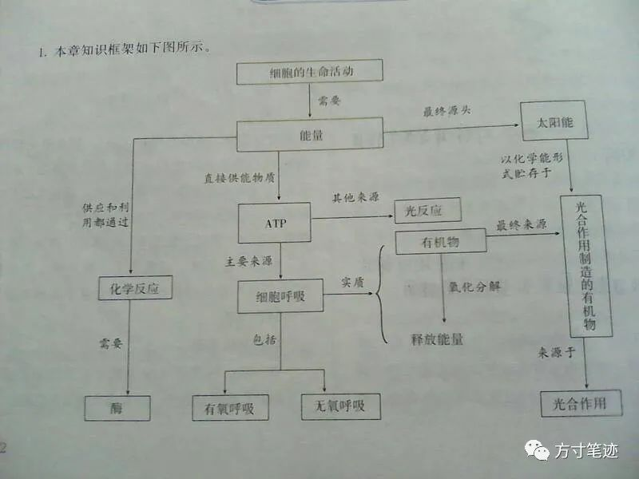
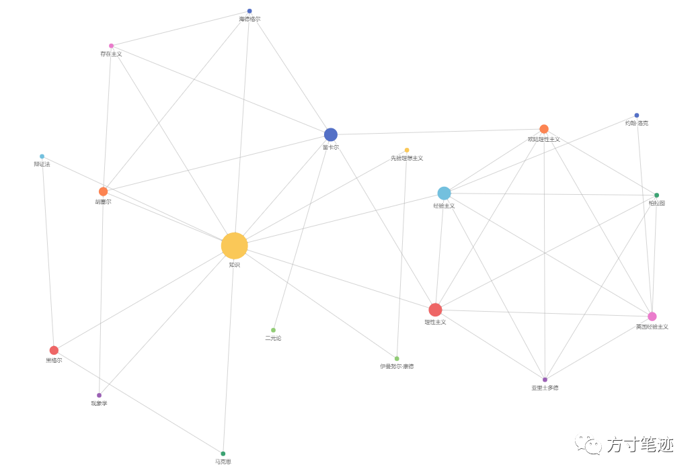
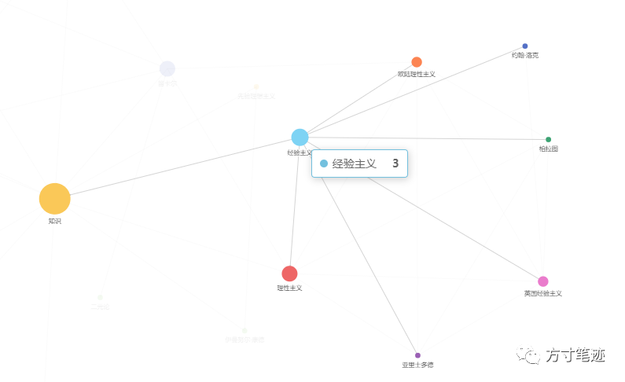
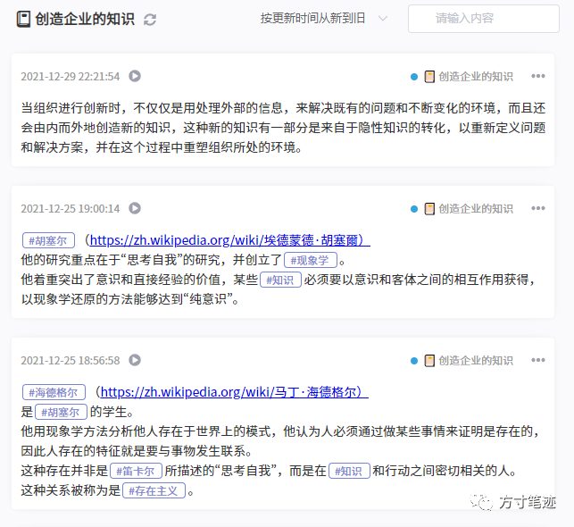

读书要不要做笔记，我想会是大家一个共同的迷思。做笔记的话就会打断阅读，花时间去记做记录；不做笔记又担心书中的知识不能积累下来，还没读完书就全忘了。然而，就算做笔记，能否坚持下来，也是一个未知数。

不过，事情不能这么看，因为书的分类不同，所要对内容进行的思考也不同。看小说，自然是要读得尽兴，跟着作者埋设的伏笔一点点打开，强行中断去做记录的话书也读不好，笔记也记不好。而另一种“干货”类阅读，就需要做很多的辅助笔记，来展开知识，这时就需要遇到知识点就要进行思考和记录，需要适时的打断阅读进行知识点深入和检索，才能对后文的阅读做好必要信息的积累。

结合之前的对费曼学习法的一些介绍（如何用费曼学习法做知识积累 【加链接】），不难发现要对一本书进行解构，那就要把整本书的内容摊开，把关键点进行连接。一般来说一本书会以一个点作为开头，最终形成“一棵树”（见图1），这时再去理顺一本书的知识关系，相比起整本书的来回翻阅检索，就会容易得多。  

图1，初中生物必修课本  

所以，这里就结构小说一类的文学作品，我从个人使用中写一点帮助和反思。  

最近我在重新阅读野中郁次郎¹的《创造知识的企业》²一书，我用方寸笔迹和费曼学习法对此书进行了一次剖解（当然是个人意义上的，不存在普遍的价值）。这本书的文献综述，在我学习后，所形成的知识网络如下图2所示。我在做读书笔记时针对不同的思考，所建立的关键词，最终构成了对我来说十分有用的知识网。

图2，《创造知识的企业》理论综述部分

譬如我想了解经验主义关键词所相关的知识，我只需要把光标移动到经验主义所在的点上，就会出现，如图3所示。  

图3，经验主义相关知识  

同样，其他的关键点也会形成类似于图3的网络关系，之前的推文中也介绍了如何建立关键词【加链接】，以形成关键词网络，如图4所示。

图4，关键词笔记  

到这里，我想大多数小伙伴已经对如何使用方寸笔迹来记录读书笔记的方法了，同时方寸笔迹也在开发新的功能帮你速记书中文字，其中包括了图片文字识别、拍照识别等等，我们会在后面陆续更新。

哦对了，还有一件事情，我们的 浏览器插件【加链接】 已经通过商店审核，大家可以在浏览网页时直接右键保存文字到方寸笔迹中，既不打断阅读，也不影响记录，祝大家使用愉快~

祝大家新年快乐，在新的一年里收获更多的知识。

参考  

1 野中郁次郎：https://baike.baidu.com/item/%E9%87%8E%E4%B8%AD%E9%83%81%E6%AC%A1%E9%83%8E/1353042?fr=aladdin

2 创造知识的企业：https://book.douban.com/subject/34853087/