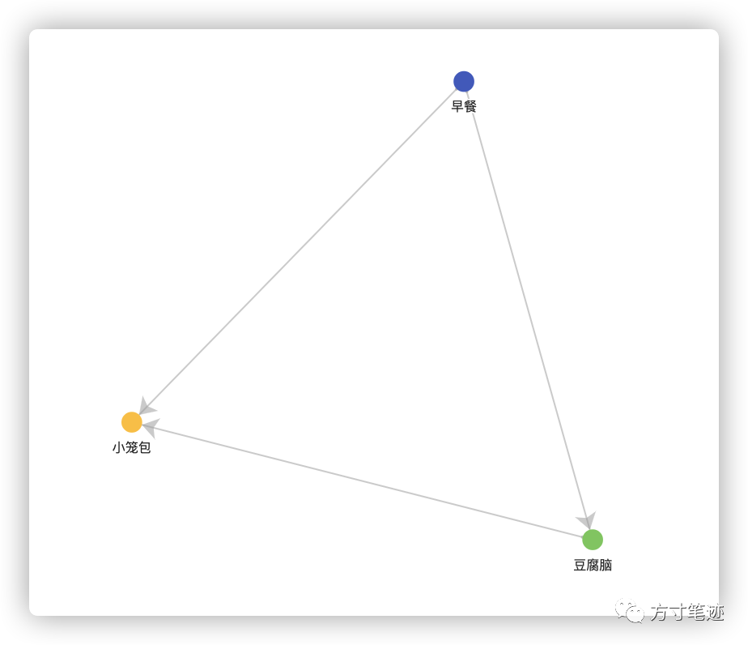

方寸笔迹的知识图谱，是基于笔记中的关键词所建立的可视化网络状结构。  

关键词的提取，并非是由方寸笔迹的算法来实现，更多的是以用户对这段笔记的感知来进行标注。其原因首先是因为算法缺乏对笔记上下文的理解，无法精确有效地定位关键词；其次就是用户是不断成长的，历史的关键词并不一定在未来也表达同样的含义，因此从用户知识积累层面来说，以用户主动的关键词标记会是一种更好的方式。  

方寸笔迹提供了常用的关键词标记方法，  

#关键词\[空格\] 

就是一个关键词识别的基本形式。

例如：  

今天的#早餐 我吃了一碗#豆腐脑 一屉#小笼包 ，精神满满！

这段文字中，按照基本的关键词提取规则，就会提取出**早餐**、**豆腐脑**与**小笼包**三个关键词，而这三个关键词又处于同一条笔记内容中，因此就把早餐、豆腐脑跟小笼包建立起关系，组织成为一个网络结构。

在后面笔记的不断积累中，被标注出来的关键词的出现频率不断增多，图谱中对应的权重也不断增大，你会在网络图中直观地看到笔记本中关键词的引用情况和关联关系，有助于你对自己知识有更明确的边界认识。