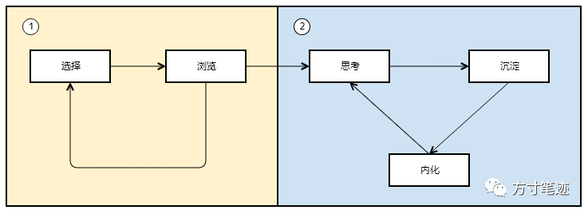
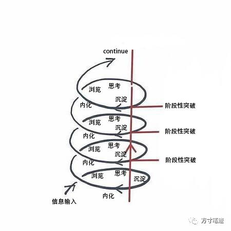

在方寸笔迹建设的这段时间里面，为了更好地论证产品功能的可用性，我订阅了大量的公众号、newsletter、RSS、blog以及网络课程，从知网和万方下载了上百篇国内外论文，试图不断地更新对世界的认知。然而，我的方法并没有带来效果，反而让我内心极度矛盾，甚至我每天都还会被同样的问题所困扰。似乎昨天已经处理解决过的问题，睡了一觉之后问题又回滚了，回到了混沌状态：昨天读过的内容也全然不记得，读过的内容似乎是读了，也似乎是没读；似乎是有用，也似乎是没用。

我的日常是，一方面每天早上我都会在地铁上刷刷错过的公众号推文，到了办公室坐下后开始从邮件列表中阅读收到的newsletter。不过由于微信中时不时的群消息，工作中不断地被打断，让我的阅读和思考变得碎片化，重新坐下后接不上原来思考的思路。另一方面，互联网环境中的知识共享者和共享平台越来越多，质量良莠不齐，信息一股脑地塞过来，给我造成了非常大的辨识知识有效性上的困扰。

我花了一点时间对这件事情重新思考，发现我在对信息欲望的边界非常模糊，很多无关的、琐碎的噪音掺杂进了我的信息渠道中，随着信息的增长，其边际价值和意义就降低了，这与经济学的边际效用思想相类似。

之前我在我自己的文章《在信息不缺乏时，注意力就变得缺乏》提到

> 注意力、精力这些人自身所有限的资源，在日常生活中也极具有稀缺性，人总是在有精力有精神的时候去做做比较困难的工作，在疲惫和缺乏精力时去休息或者做简单的工作。具有稀缺性，就需要合理的分配，才能产生最高的价值。
> 
> 刘一峰, 2020, https://ivone.me/superficial/

同样Lawrence Yeo在《A Letter to My Newbron Daughter》中也提到

> 对你来说，最有价值的事物，不是金钱，不是你的时间，而是你的注意力。你看待世界的角度是由你的思维决定的。所以，要留心你常常接触的信息和人。
> 
> Lawrence Yeo, https://moretothat.com/a-letter-to-my-newborn-daughter/

禅宗的本质，也是在教育人们培养对当下的有意察觉的注意力。  

阿尔温·托夫勒(Alvin Toffler)在其《未来的冲击》中指出：“我们在以越来越快的速度创造和耗尽思想和形象。同人、地点、事物和组织形式一样,知识变得可以任意处置了。”在信息的重荷负载下，导致了在有效学习、过滤噪音、信息选择、简单化等方面产生焦虑，特别是在跟他人的对照中：别人看了本书而我没看、别人读了一篇网络文章而我没找到等，就开始产生了对信息搜集的焦虑，如果没有好的解决方式，就会带来对信息欲望的过度膨胀和在海量信息面前的知识贫瘠。

在我看来，信息的处理分为两类：**1、浅浏览  2、深阅读**

图1  

浅浏览的意思，就是对于内容快速掠过，表示知晓而不需要对此进行学习；而深阅读则是对信息的层次化吸收。

浅浏览与深阅读之间的转化的关键点，就是对信息的思考。产生了思考，就产生了以自己为背景的信息加工，好比：我以工科和商科两种知识背景来理解工作中的某个场景，就会产生主观方向上对事情的认识，这种认识很大程度上并不代表一般化的认识。

然而信息是加工了，缺少了对信息处理的进一步延伸，加工的内容忘掉之后，就又返回到浅阅读的循环中 阅读 -> 下一条 -> 阅读 -> 下一条 ... 因此，跳出循环的第二步是要善对产出，对产出快速记录，有了产出的积累，才会在深阅读中更进一步强化自己的思维方式，跳出信息焦虑。

遗忘是人类所面临的共有的问题，唯一能破局的方法是不断对内容的巩固和再生产。巩固的方法是对一些需要加强记忆的内容，不断地记忆，能够最后随口说出；再生产的方式是对原有的内容，结合自身不断更新的知识，所产生的新的见解。这就形成了对信息处理的螺旋结构，如图2所示。

图2

在信息体量过大的场景中，往往人都会处在一种没有产出的非常忙碌的状态之中，忙于应付似乎是看不到尽头的信息内容，让人一边心理上觉得自己在吸收知识，一边因为过量的内容产生负面的情绪。正如柏拉图洞穴中的囚徒一样，成千上万的受众正在同时受到信息过载的影响。如果你把信息过载的矛头对准了信息平台，错误的归因会把人带入到极度的偏执中，仍无法脱离信息过载的枷锁，带来无尽的焦虑。