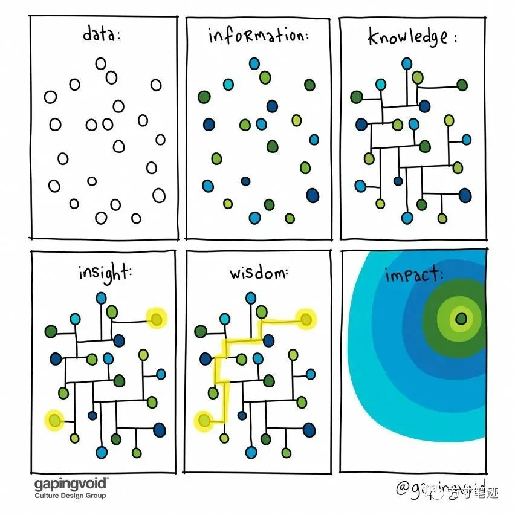

如果说学习知识是为了应付某次考试、领导的某一次检查，由外界的因素来驱使个体来学习，那么大脑对知识的记忆永远是短暂的，是无法跟过去积累的知识产生联系，永远以信息孤岛的形式存在于脑海中，就像看到一条“似乎有用”的信息时，“先Mark了再说”一样。外界的信息很丰富，丰富到你不停地阅读不停地“Mark”也不一定能读完，外界的信息不断地刷新，刺激度不断地提高，应激产生更多多巴胺，就更容易沉迷于信息中，受到信息的支配，也就是互联网中所谓的Feed流，字如其名，就是不断地给人喂养更多的信息，用更低的成本产生更高的刺激的成瘾机制，最终让人无法辨识真正有价值的信息（甚至真假难辨）。

我相信上面这张图大家都看到过。知识来源于平时所接触的信息，接触的信息面越窄，就越是无法形成关联性的知识，也就无法形成洞见和智慧，就越是因缺乏智慧，固守成见而不会主动去探索信息。不过，这句话也过于绝对，我曾经有过一段时间的信息焦虑，就是我以为自己想清楚的事情，其实并没有真正理解，我把大量时间花在了信息的查找上面，收集了非常多的资料，保存了很多文章，到头根本看不过来。还有个很流行的词叫做信息糖尿病，就很贴切地描述了我这种问题：信息太多而大脑根本没有足够的消化方式，处理信息的事情本身还在消耗大脑的资源。

在一个原本就不是很稳定的知识地基上，不断地搭建碎片化的空中楼阁，思考的节奏跟不上信息下载的速度，那焦虑的出现肯定是自然而然的。

后来我在福格行为学中了解到，花足够的时间来设计一个行动计划，与将来执行计划所花费的时间相比，用于思考的时间微不足道，而且这些思考会使将来的执行更加有效。

> 停止自我批评；
> 
> 把你的愿望拆解成微行为；
> 
> 将每一次错误当成是一种新发现，并利用它们不断改进。

福格行为学给了我一个思考问题的方法，让我从面向信息，转而面向自己，先不管还有多少知识没有学到，要先了解自己懂了哪些，自己的知识能否为下一步展开复杂的思考提供支持。

弄清楚信息的主客体，是谁有信息的需求，是谁获取信息，是谁处理信息。这一点弄明白了就不难会理解对信息的需求到底是什么。基于此，我开始寻找能够让信息转变成知识的方法，刘未鹏在他的博客中说“你所拥有的知识并不取决于你记得多少，而在于它们能否在恰当的时候被回忆起来。”，书架上和kindle里的书，让我感觉似乎是阅读了很多，但又没有一本书会在看到书名时回忆起书中的主旨内容或是主角名字。

于是我找到了许多笔记法（之前我也提到过我尝试了很多种笔记法，但没有一种算得上真正排的上用场，所以我才自己设计了方寸笔迹这款笔记产品），但笔记只能是学习的开始或者是终点，我可以对笔记中的文字进行延伸或者把自己的思考记录下来，但这并不是信息向知识转变的过程。

在探寻知识转化的过程中，有幸学习了知识论相关领域的作品。信息在向知识转变、知识在从隐性到显性的转变，是需要个体把获取到的信息搭建成为自己的知识网络，把不同的知识真正产生关系，然后通过写作的方式把自己习得的知识表达出来（同样这也是费曼学习法的精髓），让大脑中的记忆神经元产生物理关联，才会把信息转变成知识存储到记忆中。所以说，知识根本上不存在学科之分，也不存在文理之分，越是归根到底，越能发现不同知识之间的共性，查理芒格也说过

> 我们的教育极度缺乏学科一体化，许多问题都是跨学科的，如果不运用跨学科的知识来解答，就相当于一个桥牌手把所有的注意力都集中到将牌上，对其他任何因素都不予关注。

然而，无论是转化哪种知识，根据艾宾浩斯记忆曲线理论，记忆终归会被忘记，那么如何选择知识的载体，这又产生了新的问题。

我认为知识的载体是大脑+笔记系统，我可以通过一个例子来说明我对问题的理解：

如果把人的知识比作是计算机，那么笔记系统应该是硬盘，存储着大量结构化的非常用的知识，大脑提供内存和CPU的功能。在需要知识的时候，可以从笔记中提取出来，到大脑内存记忆中，核心的思考处理是基于内存信息进行知识网的编织，搭建起网络化、层次化的知识图谱，大脑只提供图谱的记忆，具体内容下放到笔记系统，对于所需要的节点的内容只需去笔记系统查找即可，真正很少人能有像福尔摩斯那种记忆能力。

然而，我所描述例子还是简化了整个记忆过程，大脑对我们来说重要的是触类旁通的功能，这是计算机所完全无法相类比的。

> 我们在从既有经验中总结知识的时候，应利用适当的抽象来得出适用范围更广的知识（而不仅仅是一个萝卜一个坑）；另一方面，在遇到新问题的时候，同样应该对问题进行抽象，触及其本质，去除不相干因素避免干扰，从而有效提取之前抽象出来的知识。

知识的来源也是复杂的，人的感官会形成新知识，推理和归纳也会形成新的知识。这两种知识的来源并不是相互对立、相互矛盾的的，任意来源的知识都是可以经过大脑的举一反三抽象思考总结出来，对于未曾经真实经历的事情也能有自己的认识。一朝被蛇咬十年怕井绳就是非常具体的例子，计算机可不会有这种高级的思维。所以说很多人的聪明不是来自于他读了多少书、做了多少笔记，书本可以提供最基础的举一反三的例子，在他思考的过程中产生了无数条推理是我们所无法看到的。

因此，对待知识单纯以经验主义或者理性主义的态度，只是在采用肌肉锻炼的方式 -- 用同一种方法不断地重复，以求在量变中达到质变。然而健身教练也不会说存在局部减脂的方法，所有的减脂都是全身的、系统的，肌肉之间也是相互影响，锻炼一部分肌肉势必也会带动关联肌肉的增长。虽然说要撇开木桶理论，去发展自己的优势，然而优势的发展必然不能是单一技能的精进，不要忽略大脑触类旁通所带来的系统性的提升。

李笑来写过一本书叫《把时间当做朋友》，把我从仅仅为了托福刷分的循环中拽了出来，给了我一个学习意义的寄托，在自己很矛盾的时候让我重新跟自己和解。书中有提到

> 获取更多知识几乎是我们开拓自身心智的唯一手段。对绝大多数人来讲，学习能力也许是一生中最重要的能力。

这本书给我带来的感受就是，无论是学习、工作，还是日常中的一些琐事，都是有限游戏所集合成的无限游戏，陷入在有限游戏的泥潭中就无法真正地提炼知识，把每件事情看作是相互独立的，就不会产生复利所带来的高回报率。巴菲特的投资哲学同样也是跟时间有关，至少在投资中盯着k线图给我带来的是刺激感，在卖出之后的股价进一步的拉高又让我悔不当初，而巴菲特却能在狂跌的时候丝毫不为所动，狂涨的时候悬崖勒马，他会持有某只股票二十年、三十年，来获取这只股票真正的价值收益。

所以，方寸笔迹的设计哲学遵从了许多尚处于理论还没有被实际应用的层面，好比说仍在探索中的知识图谱（未来会有三种知识图谱），孵化中的记忆曲线，已经上架的浏览器插件等等，我希望方寸笔迹能给大家以时间杠杆，来撬动知识的积累效率，创造更多个人的知识财富，我们不能让笔记停留在Mark后再说的层面，我相信每一条笔记都有记录者本身的动机所在，也同样受记录者当时所处环境的影响，每一条笔记都应该被无条件的认真对待。你的笔记，就是你的大脑。

___

_感谢_两位共建者_  
_

**_@phil_**

**_@Rock Mount_**

_近期在群里给方寸笔迹的成长提出更好的思路，我们已经采纳并加入到开发计划中，会在后续的版本中陆续更新，非常感谢。_

___

如何使用方寸笔迹

_在浏览器地址栏输入：https://fangcun.in （目前仅支持web浏览器端使用）_

_使用帮助：https://help.fangcun.in_

___

**延伸阅读**

-   _福格行为模型：[https://book.douban.com/subject/35594496/](https://book.douban.com/subject/35594496/)_
    
-   _gapingvoid - Want to know how to turn change into a movement?：[https://www.gapingvoid.com/blog/2019/03/05/want-to-know-how-to-turn-change-into-a-movement/](https://www.gapingvoid.com/blog/2019/03/05/want-to-know-how-to-turn-change-into-a-movement/)_
    
-   _刘未鹏 - 如何有效地记忆与学习：[http://mindhacks.cn/2009/03/28/effective-learning-and-memorization/](http://mindhacks.cn/2009/03/28/effective-learning-and-memorization/)_
    
-   _神经元网络如何实现记忆功能的？：[https://www.zhihu.com/question/321417604](https://www.zhihu.com/question/321417604)_
    
-   _看到记忆的印迹：神经科学家们如何定位、唤醒甚至偷换记忆：[https://biotech.org.cn/information/152524/](https://biotech.org.cn/information/152524/)_
    
-   _把时间当作朋友：[https://book.douban.com/subject/3609132/](https://book.douban.com/subject/3609132/)_
    
-   _穷查理宝典：[https://book.douban.com/subject/5346110/](https://book.douban.com/subject/5346110/)_