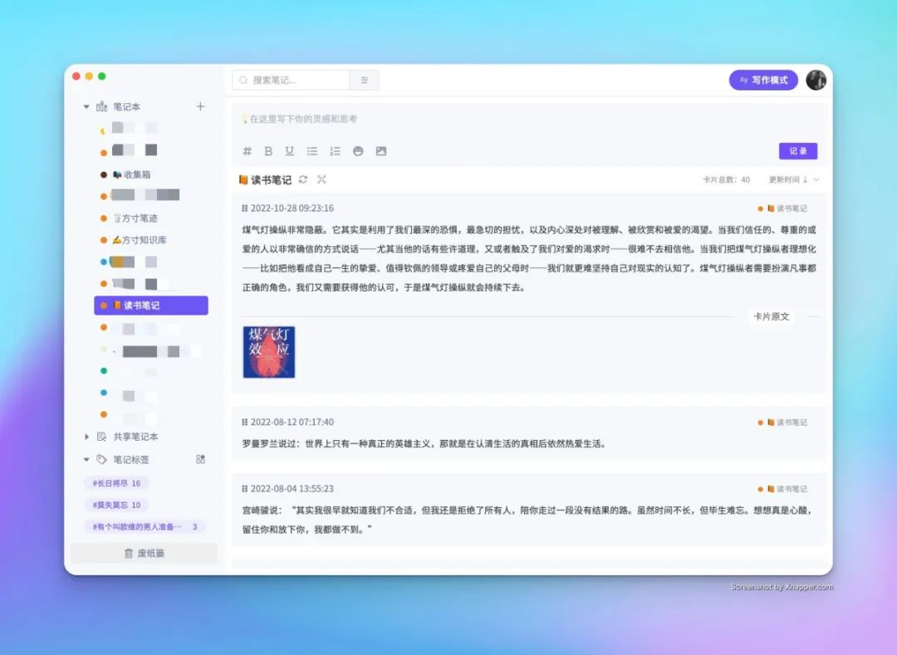

## 🎨 新功能

## 🌈 图片折叠（v1.1 已上线）

桌面端已经发布了卡片笔记的图片折叠功能，对于图文混排的内容来说，卡片的长度会过于难以控制，出现超长的卡片，图片也会影响卡片的文字阅读的连贯性。

我们把文中的图片拆离到卡片底部，形成卡片的图片区域，无论多少张图片都会形成缩略图并以固定的大小固定在底部，通过点击可以放大图片浏览。

当然，对于图文混排来说最重要的就是图片与文字的顺序，并不像微博那样一段话加上几张图，而是一段文字+一张图+再来一段文字+再来一张图，混排对文字和图片位置有固定的要求，因此我们增加了展开卡片功能，展开后可以看到完整的卡片图文内容。

web端近期也会上线。

## 🎯 卡片回顾提醒（下个版本 v1.1.2）

想必大家都有随手摘录后，笔记本里积累了非常多的卡片，想整理但无从下手，于是就会越来越多，最终也不想回头整理了。

所以我们做了一个简单的设置，针对笔记本增加了卡片提醒的功能，你可以自由设置笔记本内卡片的最大值，当到达最大值之后，会通过微信公众号推送回顾通知。

卡片笔记法固然好用，但盒子的容量也是有限的，无限的空间会带来无限的内容，无限的内容就会让卡片失去意义。

## 📌 图片尺寸设置（下个版本 v1.1.2）

很多用户给我反馈说图片占空间太大，能不能加上图片尺寸调整的功能。

因此，我们在卡片和写作中增加对图片尺寸的调整，就不必再看到上传一张图片后，图片占满屏幕了。

## 🔨 设置中心（v1.2版本）

web端设置中心会迁移过来，目前已经启动。

## 疑问解答

## 腾讯文档同步，怎么还没上线？

腾讯文档官方的更新文档内容接口还未上线，我们正在以其他方式尝试将写作模式笔记导入到腾讯文档中，方便你做后期的格式化文件操作。

## 移动端什么进度？

移动端在开发，但是我们现在主要的工作目标是以完善桌面端为主，桌面端功能完整后会迁移到移动端，因此移动端现在仍是在构建底层的状态。

## web端为什么更新的这么慢？

跟移动端原因类似，现在桌面端的部分功能已经成熟，已经开始在向web端迁移**写作模式**、**标签管理器**，图片缩略图功能已经进入测试流程，后面web更新会与桌面端同步。

## 我有时访问不了网站，怎么回事？

之前一直在用cloudflare提供的DNS解析服务，近期已经迁移回国内解析，并重新部署了全国的CDN，相信web端速度已经有所提升。服务端我们近期也会增加一条线路的服务器，提供多地区服务通信。同时，在web更新的过程中，也会增加数据提取算法上的效率优化。 

我们单独部署了国内的加速域名，你可以通过 **www.fang-cun.net** 来使用，与之前的 www.fangcun.in 服务完全一致，在速度上会提高很多。