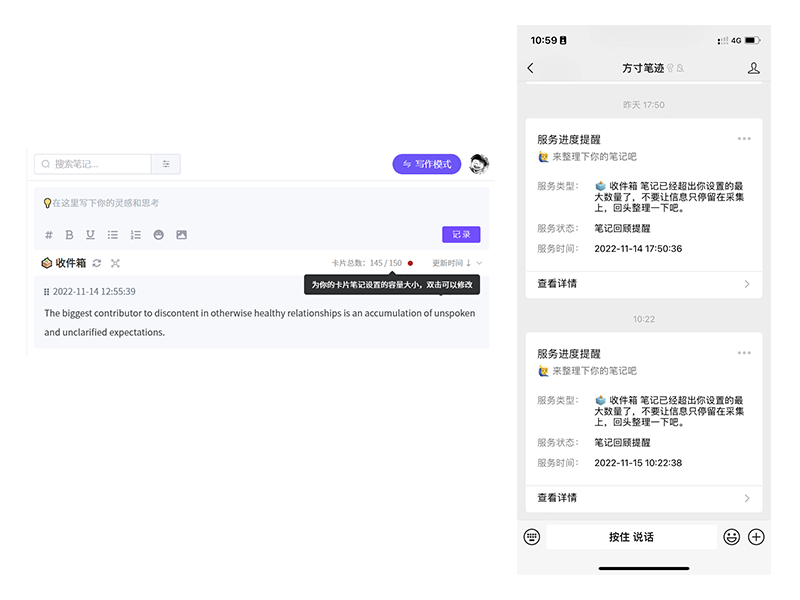
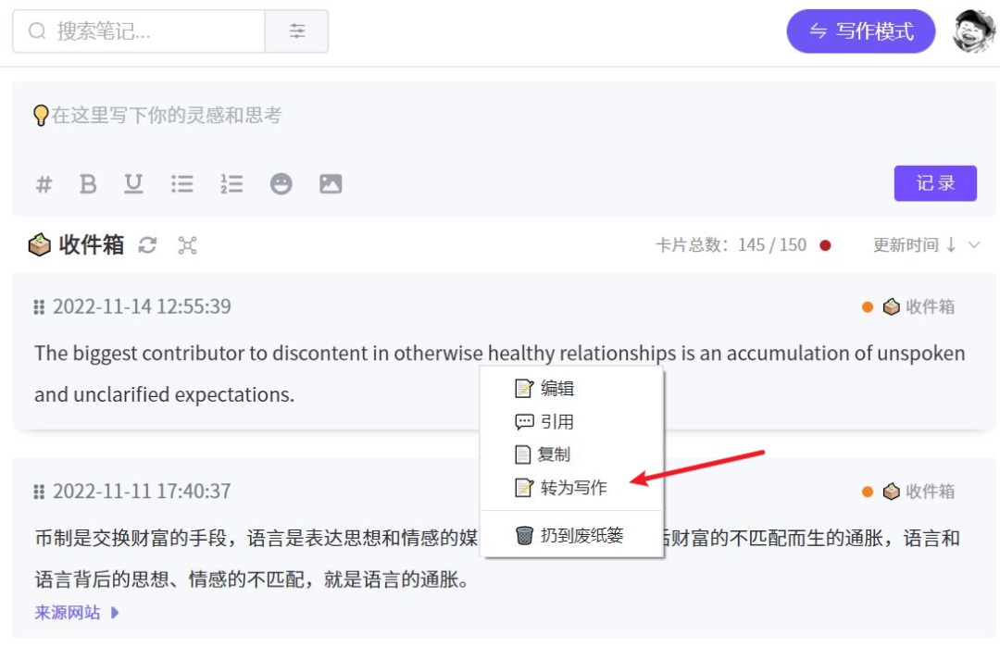
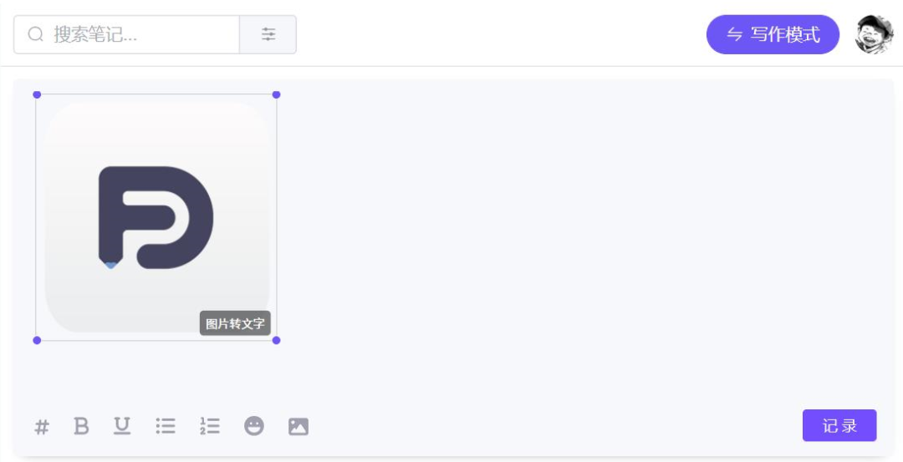
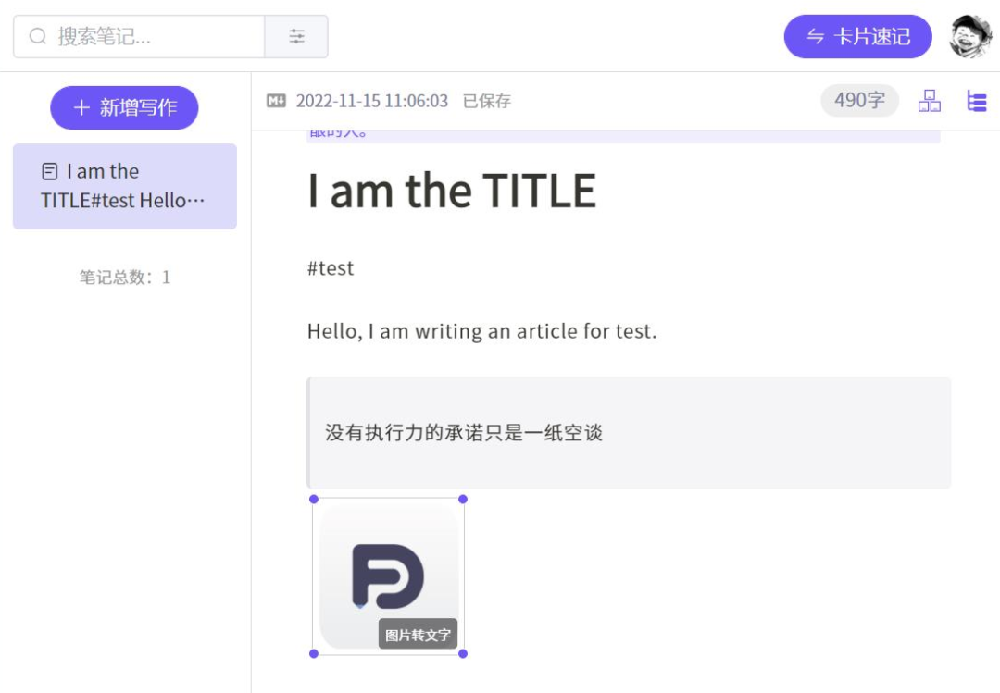
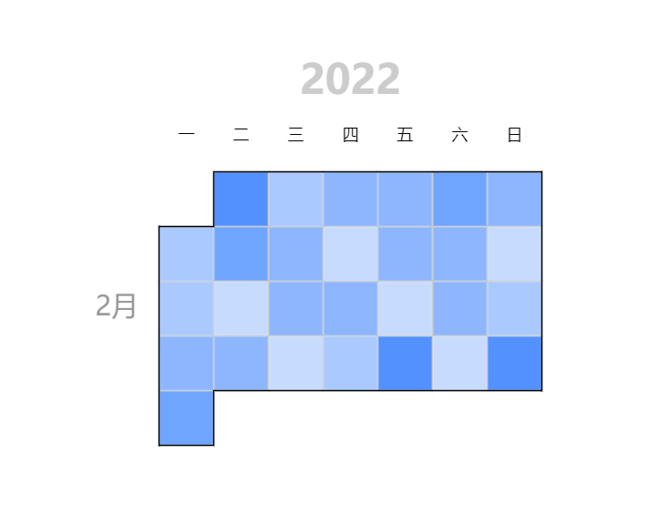

桌面端1.1版本已经开发结束，在这个版本中，我们修复了数十个bug，更新了5个版本。如果你还没收到1.1.5版本的更新，可能是还存在CDN的缓存，你可以稍等一会，或者点此链接下载

win：https://maoer.cc/n9xqj8  

mac：https://maoer.cc/f6d704  

在1.1版的最后，我们增加了如下的功能：

## ⏰ 卡片笔记数量预警

你可以按照你的笔记本，设定笔记本中卡片的阀值，在达到一定卡片数量之后，通过提醒的方式来回顾和整理你的笔记，避免你的笔记本中卡片太多整理起来无从下手。

## 📃 卡片笔记转写作

有的小伙伴在卡片构思和修改中，单个卡片的笔记内容会越来越多，卡片就会显得太长，缺乏卡片单一主题的原则，卡片内容已经不再是卡片该有的。因此，我们提供将卡片一键转为写作笔记，减少了来回剪切复制的复杂操作，你也可以在卡片写作时也无需有后期转为写作的负担。

🌊 图片剪裁

之前版本的图片上传之后，就会按照图片原始尺寸显示，会让整个卡片或者写作内容被图片占据大多数空间，显得很不好用。现在你上传图片之后，可以按照你的需要调整图片的尺寸。

## 👨💻 核心服务优化

有小伙伴反馈北京地区网络存在问题，经常无法连接，提示网络错误。因此，**我们在北京地区单独部署了服务器，****优化了北京及周边地区的数据读取效率**。

## 🤔 1.2 版本有什么

在下个版本1.2.1中，我们会开发独立窗口的标签管理器以及可交互的笔记日历关系图。

新版中我们也会提供笔记内容以独立窗口方式打开，便于你脱离单一窗口的限制，在写作时也能快速查找卡片笔记的内容。

桌面端优化和新功能开发仍在继续，web端功能迁移已经进行了部分，但仍未到发版的阶段，我们会尽快把桌面端可供迁移的特性转移到web中来，便于你在各种场景下的使用。

👋 下次我们再聊，有问题可以联系我：ivone@fang-cun.net