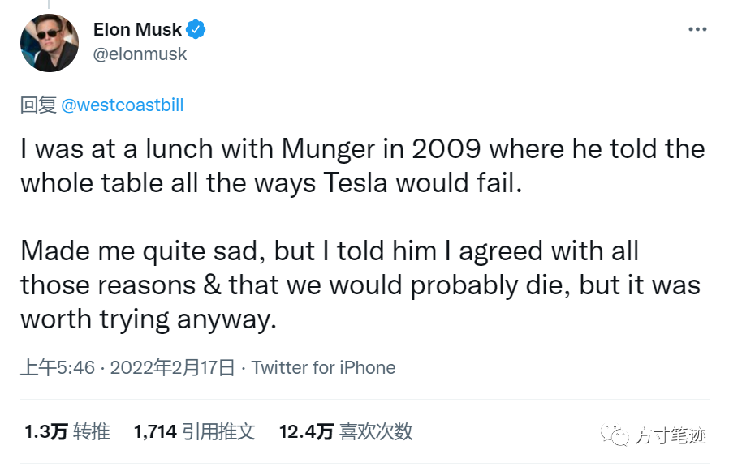

本周一我们上线了移动端小程序（_在文末扫码可以体验_），比之前说好的上线时间延迟了几天。开发移动版期间，很多人问过我什么时间能上线，其实每次被问我心里都是没底的，因为有段时间我总觉得要以完美的姿态展示给大家，所以无论是界面还是体验，我一直在反复测试、校准，团队的小伙伴也被我搞得很焦虑。

在移动版设计之初，群里面的朋友给我提了很多要求，我就以大家提的要求来不断地增加方寸笔迹的边界，比如：资源加载效率、数据计算效率等等效率成了头等指标，我们以头等指标为指导，做了新的搜索引擎方案、高可用缓存方案等等大量繁重的工作，因为我的原因导致了方寸笔迹进度一直停滞不前。

前几天我在浏览Elon Musk Twitter的时候看到这样一条消息

我尝试翻译一下

> 伊隆马斯克：
> 
> 2009年我曾一次与查理芒格共进午餐，席间他告诉我特斯拉项目肯定会失败。我听了之后心里很不是滋味，我告诉芒格，你说的我都同意，特斯拉的确有概率会失败，但这并不是我放弃的理由。

我读到这里，有种开悟的感觉：我被条条框框限制住，去寻求结果导向，在用结果作为整个工作过程的参照物，我所有的工作都是要达到、实现设定的结果，让我忽略了最重要的过程。也就是说，我一直在朝着方寸笔迹最终的形态设计。

Elon Musk的这句话让我重新理解了迭代式思维方式，特斯拉不是一两年就成为今日的模样，多年来也是由工程师、设计师不断地产生灵感，不断地测试，再更新到车体中。迭代式思维是允许产品不完美，允许存在部分问题和漏洞，通过不断地增加创意，让产品从粗糙到精致再到完美。

台湾作家黄丽群在一席演讲中说

> 命运是这样一个大的东西，它是这样一个贯穿横亘于人类古往今来的沉甸甸的存在。可是随机性恰好相反。随机性是极微小的，是琐碎无关宏旨的细节，你会特别容易忽略它。它的存在或不存在都不影响历史的进程，可是它会为命运在你身上刮擦留下的痕迹做一个决定性的定义。同时它没有逻辑，是真正不可测的神秘。
> 
> 就像是蛋糕，你吃进嘴里，会知道那里面有盐，有糖，可能还有一些柠檬皮。可是你看不见。它极为地微小、极为地缥缈，可是它决定了滋味

结果，也就是黄丽群中所提到的命运，根本上是由过程来实现的，而存在于过程中又不影响结果的细节，它们使得产品变得完美，也决定了产品的体验。方寸笔迹已经上线数月时间，不断地在修修补补，隔段时间更新一个较大的功能，现在看来已实现了里程碑的意义。但这仍然是迭代过程中的一点点前进，虽然现在不够完美，偶尔还会出现bug；有时候团队小伙伴会忙于论证功能，有时候放下一切救火改bug ... 这些事情都没有影响现在方寸笔迹的表现形态，但在过程中赋予了这段时间更多的意义。

___

**移动版体验二维码**  

**延伸阅读**

-   Elon Musk Twitter：https://twitter.com/elonmusk/status/1494065800482902030
    
-   黄丽群，大命运上的小机关：https://yixi.tv/#/speech/detail?id=571