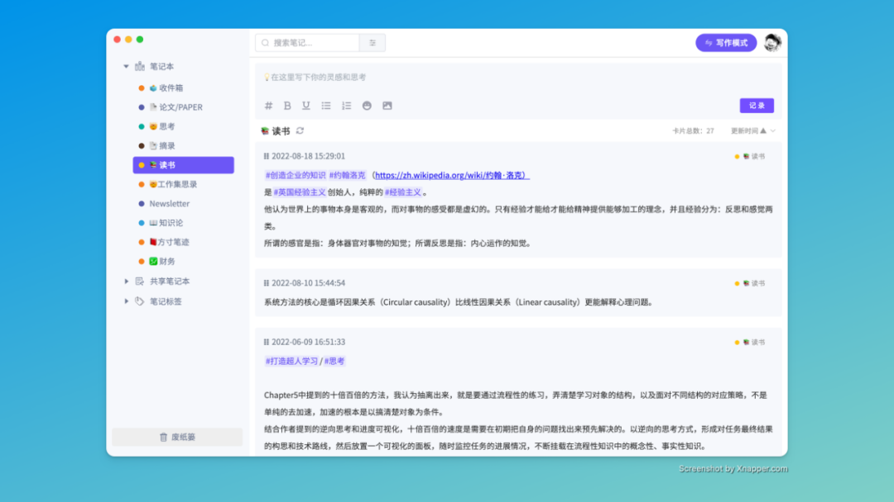
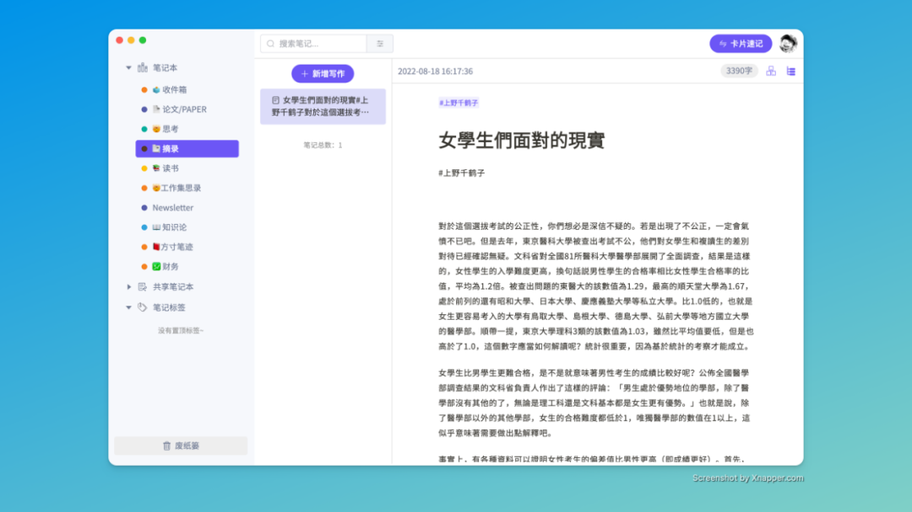
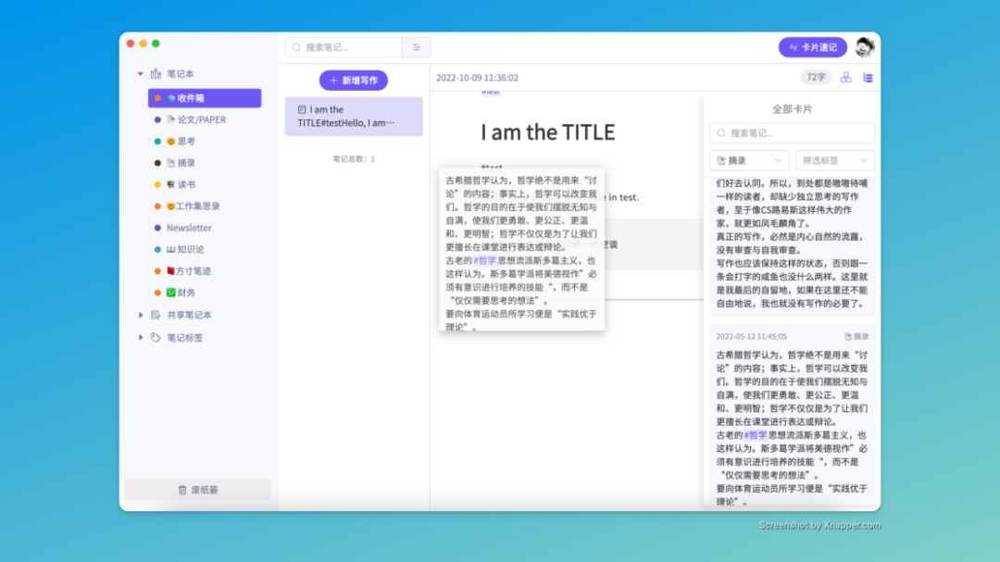
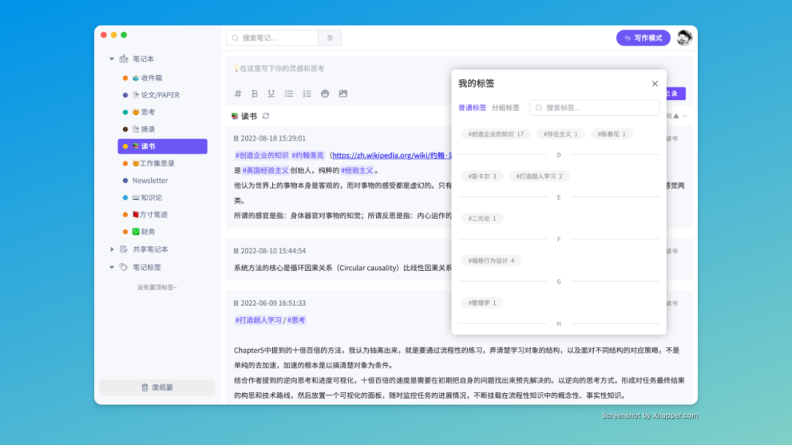
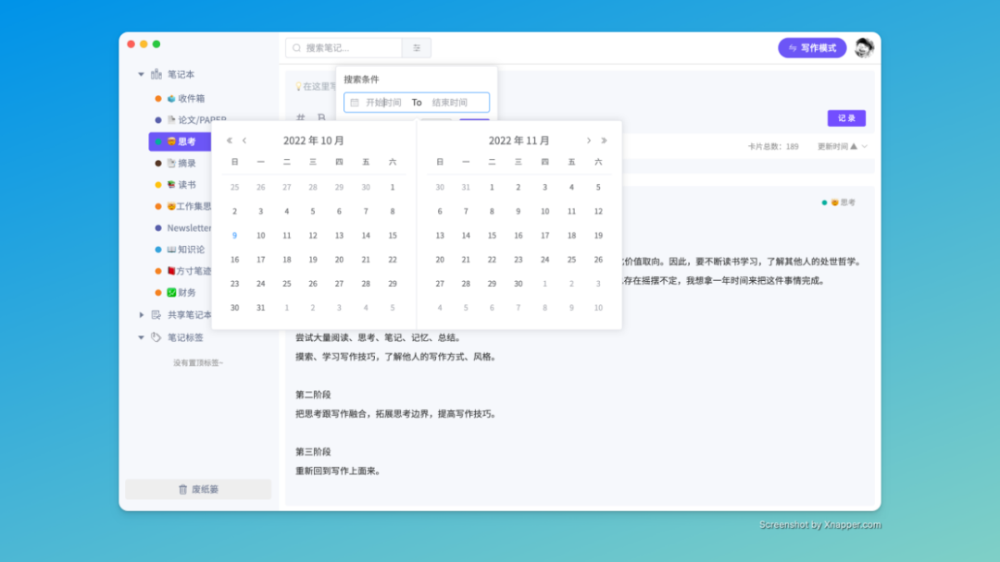

 **👋** Hello 朋友们好，我们又是好久不见了。

方寸笔迹桌面端的正式版，已经开发完成，预计很快就能跟大家见面。我们本着**快记录，慢管理**的原则，方寸笔迹正式版的侧重点依然是在**信息的转化**上面，主要是面向信息的采集和初步的加工，现在以及未来都不会过多的偏向于对文本的复杂处理。如需复杂操作，目前卡片笔记可以同步到notion中，下个版本会增加写作模式同步到腾讯文档。短时间内也会增加其他卡片笔记App来源的导入功能。

作为正式版的第一个版本，我们重构了许多功能，但此次仅限于桌面端，web端的调整已经确认，不用多久你也能在web端体验到写作模式，移动端目前以iOS为主，正在做原生App的开发。

## 📣 功能调整

### 📇 笔记拆分

正式版中，笔记按照属性，拆成了**卡片速记**与**写作模式**两种场景，卡片速记是旨在快记录的原则上，快捷键、浏览器插件、微信内容等等都是快速记录的笔记来源，都会作为卡片速记存储；而写作模式则改为了**三栏布局**，从卡片速记中分离，提供写作的快速检索和卡片的拖拽引入。

### 🔖 标签管理器

当使用一段时间后，标签就会多到无法管理，无法检索。正式版中增加了标签管理器功能，按照首字母做了索引排序和关键词查找，便于你更好地管理标签。

### 🕛 笔记时间检索

我们在笔记检索中增加了按照时间周期的检索，便于你更方便地查找笔记。

## 👨💻 开发者有话要说

在beta阶段我们犯了很多错误，也走了许多歪路，此次正式版上线不仅仅是方寸笔迹的一个里程碑，也是我们团队一次淬炼之后的新的起点，如白皮书中引用肯尼迪在登月前演讲话：我们选择在 10 年内登上月球，并做一些其他的事情，不是因为它们容易，而是因为它们很难；因为实现这个目标有助于协调和衡量我们最佳的力量和技能。

非常感谢大家对方寸笔迹的认可与支持，前段时间的更新确实有点慢，但大家完全可以放心，我们有信心和能力把方寸继续做下去，五年十年乃至更久都不是问题，后面我们会花更多的时间把功能的完成度提升上去，让大家不仅仅是觉得可以用，更多的是好用与丝滑。

方寸笔迹团队，敬上。