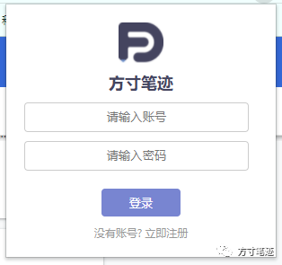
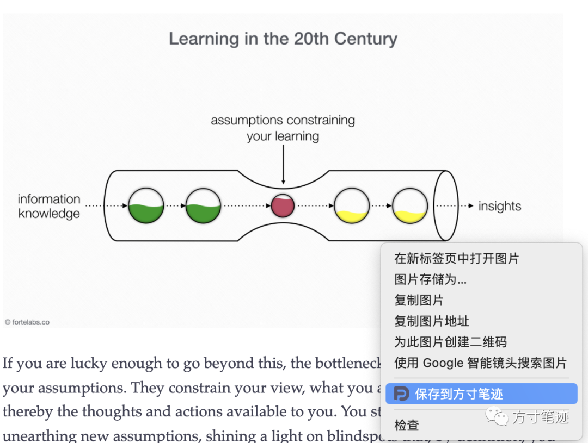
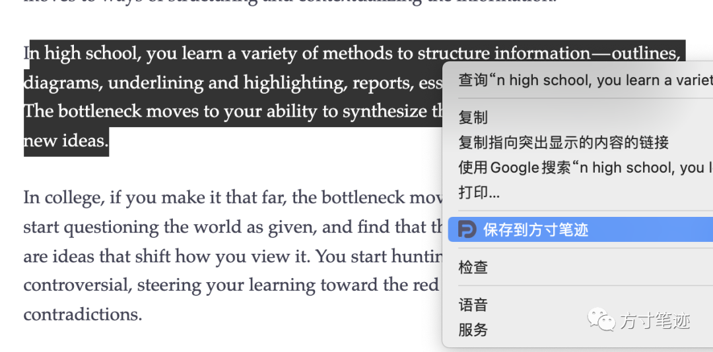

方寸笔迹近期开发了一款浏览器插件，在电脑浏览器端选中文字或图片快速保存的功能，便于你在阅读过程中不打断你的阅读状态，可以便捷地记录笔记。

目前插件只能适应谷歌（Chrome）浏览器，对于其他浏览器的兼容性仍有待进一步验证。

谷歌(Chrome)浏览器安装方法

在浏览器地址栏输入：chrome://extensions/

摁下回车键后，会打开浏览器插件界面，将你刚刚下载好的crx插件直接拖到界面内，就可以正常安装。

使用方法

点击打开插件，以自己的方寸笔迹账户信息登入。

然后打开新的网页界面，对网页中的任意文字、图片右键选择后，都可以保存到方寸笔迹中。

近期我会把插件的安装包以邮件方式，发送到各位已绑定邮箱的用户手里，优先体验，正式版插件预计在1月上旬正式上线，并提供下载。

小伙伴也可以扫描下方二维码加入我们微信群，随时获取方寸笔迹的最新信息。

