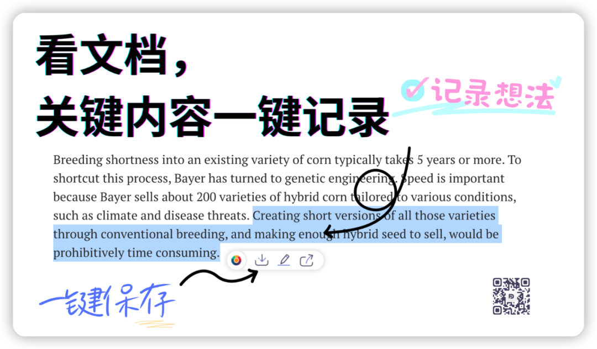

笔记的目的，就是用来删的。  

我给很多人说过，他们都觉得与事实相背，认为要好好珍惜自己的想法和摘录，因为大脑根本记不住这些七七八八，删了多可惜。

人往往会对失去这件事情特别敏感，删掉一些常年不会看的笔记时，还会心生顾虑，总觉得什么时候可能会用得到，积累的笔记越来越多，管理起来越来越麻烦，越来越像一个烂摊子，最终自己也没法好好回顾，最后两手一摊，得，是你这个工具不行，我这就去给你个差评。

很明显，这些用户把笔记工具当作是网盘来使用了。

不过，我说的是要删笔记，也不是不珍惜笔记。我就拿个日常的例子 -- 听课的笔记 -- 来掰扯掰扯。上课的时候是需要记录笔记的，当老师讲到的内容自己还没理解或者是需要花时间充分理解，就快速记了下来，实际上，这时记下来的是一个时间切片，把思考进度、知识点都塞到在切片里，待课后回头整理笔记，才会更好地转化吸收，转化后笔记就会被新的笔记覆盖，旧笔记就只剩下了怀旧的意义。可如果当时没来得及回顾，过几天再回头去看笔记的话，很有可能这个时间切片就已经丢失，当时的思考进度也不在了，这条笔记就完全失去了存在的意义。

所以，无论是完成了转化，还是太过久远，用唯一对自己负责的态度来说，就是删。

可见笔记最终是用来服务于短期内的回顾，趁着大脑还处于思考的惯性阶段，对上下文还有一定的记忆，快速转化为可用的知识。而笔记本身只是大脑思考的缓存，缓存很容易被覆盖和删除，所以需要工具来转为半永久存储。

啊？为啥是半永久存储？

因为要删啊。

无论哪种笔记方法，不回头整理，记录得再好看、再花哨也没用，有的人写笔记就只有只言片语，有的人还会画上符号，这本身并不存在好坏优劣，反正最后都要删掉。

而对我来说，做笔记最高频的场景，除了上课之外就是阅读，而非结构性阅读最多的就是在浏览器上面。我在阅读的过程中会对自己已有的知识刨根问底与阅读的内容碰撞和融合，结合自己的经验产生全新的知识，但为了思考惯性的统一，文章还要继续阅读，如果我不快速记录下这段想法或者原文，这个想法就会在我继续阅读思考的时候消失，最后想破头也想不出来。

Highlight插件就是基于上述场景下开发的工具，我自己用了很久，每次阅读我都会做好笔记，读完了就会立刻找出来输出成自己的内容，并且清空笔记以便更好地进行下一篇内容的阅读。

本插件以轻巧为主要目标，不会延展太多复杂、臃肿的功能，专注于在这一个细分的切入点，优化用户体验，数据会通过公开的API同步到Notion、Flomo等，你可以在这些工具的移动端上查看。本插件的作用会是一个中转器，它在距你里思考最近的地方，在距离你写作最远的地方，时常把它清空掉才是最好的使用方式。

在方寸笔迹公众号回复“**获取插件**”，可以获取插件预览版的下载地址，审核完成后我会提供插件的插件商店地址。