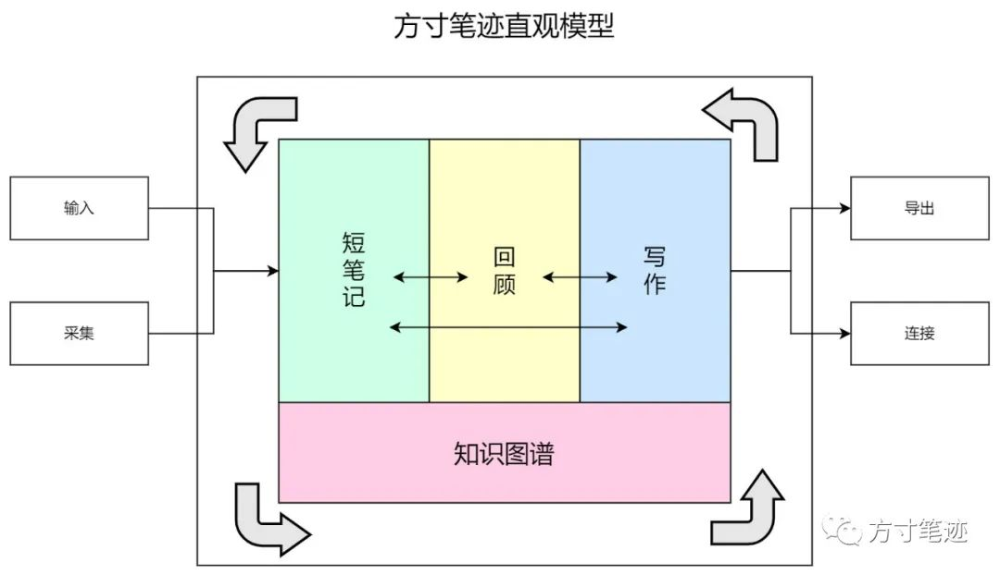
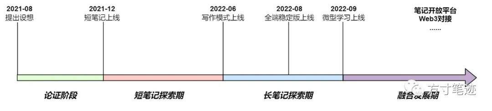

*本文是方寸笔迹设计白皮书精简版，主要介绍方寸笔迹的产品定位、产品特征和未来规划，如果有疑问和想法，可以联系我：ivone@fang-cun.net。本文5800字，阅读可能需要一些时间，PDF文件下载在文末。

___

**· 背景 ·**

在国内新冠疫情爆发后，互联网作为社会的基础设施，给部分有能力的企业提供了居家办公的环境，居家办公成了企业在面临疫情这种无法集中办公时的另一种有效办公方式，线上会议、线上教学等等需求在这个窗口期集中爆发。

在这个阶段内，摆脱了传统的线下工作、学习的方式，各行业数字化趋势愈加显著。在数字化过程中，每个人的工作对象开始转向面向数据、信息，催生出许多场景化的工具类软件。

另外，z时代人群的崛起，互联网土著居民离开校园参与社会劳动，社会对互联网的认知发展了改变 -- 社会对互联网产品的依赖性增加，对互联网产品的需求也发生了巨大的变化。个性化需求和场景不断出现，原本标准化的产品难以通过增加产品线和调整供需关系的方式满足不断增长的个性化需求。

在这个过程中出现的许多笔记工具（如：flomo、cubox等），相比起传统的信息记录工具（Evernote、有道云笔记等）来说，新一代的笔记工具（热门的工具如：Obsidian、Notion等）抛弃了传统笔记的文档格式、文字修饰、长篇摘录等等，以体量轻便和双链关联为核心，区别于传统线上信息记录工具。

不过，无论是传统的笔记工具还是新一代的笔记工具，本质上还是对信息的存储和积累。通过我对已有工具的观察，非常多的工具是以横向拓展自身的连接性为战略导向为用户提供信息的存储，但是在存储之后并没有相应的笔记产品行为给用户带来延续性的行为，仍然没有达到给用户带来知识管理的质的改变。从用户角度来说，所存储的笔记信息都是为了更好地积累知识，以求在需要时快速检索，以及能通过某些方式达到知识的复利效应。所以说最前端的采集行为，无法带来后续延展的价值，也难以通过产品的影响力给用户带来知识复利的方法。

也可以说，每个人在知识经济时代，都是在探寻一种更为有效的知识管理方法，这就是为什么非常多的用户喜欢多款工具协同使用，以求用自己的知识管理方法能给自己带来最大的效益。如果换个角度来看，一款具有理论背景的知识管理工具，能给用户带来的，是在不改变用户已有知识管理方法前提下，给用户提供潜在的知识管理方法指导，协助用户更好地积累、转化知识。

同时，我们在不同的场景下如：交流对谈、听讲座、分享会、读书、学习等场景中，巨量的信息给我们带来了知识量的激增，但是截至目前所有的互联网工具，都没能解决知识积累却无法有效利用的困境。互联网工具大多数在关注前期的信息积累，无数的采集工具、剪藏工具和笔记工具，都没能为用户提出一种有效的知识积累理念，也没能把知识管理应用到产品内核中，因此，我决定借鉴知识管理领域的诸多思想工具，开发一款打通前端信息采集到知识转化最终到知识输出的应用。

****·** 概述 ·**

每一款笔记App，都存在自己独特的理念设计，但从根本上来说，笔记App都是用来替代传统的纸笔笔记，以数字化形式来记录信息和知识。

然而，信息来源的场景非常多，如：课堂笔记、会议笔记、读书笔记、论文笔记、灵感笔记等等，不同的场景下，对笔记的要求是不同的。所以一款笔记工具，要么是垂直于一个或者几个场景深挖痛点（如：讯飞听见），要么是做标准化的解决场景（如：印象笔记）。做一款通用型的笔记工具，就要兼顾所有场景，或者说是要把所有的场景抽离出一般化的应用场景；而做一款垂直类的工具，就需要对某特定领域的深入分析研究，通过复杂的技术来满足特定的场景。

之前非常火的All in one的工具，看似是满足了用户非常多的使用场景，如同瑞士军刀一样打开后各种各样的刀子呈现在眼前。同时展开面向多个场景的设计，势必需要有巨大的投入，如果管理不好就会出现对应的刀子太钝连纸都切不碎的情况，况且不是所有人都需要其中的部分冗余功能，就导致了工具自身体量太大。即便这会吸引非常多的用户，但工具自身的定位就会产生混乱。

一款All in one的工具并不能完美解决用户的所有场景的需要，即便是在部分场景下体验尚可的前提下，用户也存在相同场景下的个性化的处理需要。从幂次定律可得，一般化的工具，可以满足用户80%的笔记需要，剩余的20%个性化需要很难在同一款产品中得到满足。当然，一款All in one的产品也不会为了20%的个性化去调整产品自身的特性。

方寸笔迹的目标不是一款Allin one的笔记工具App。由于用户的某些个性化需求无法满足，用户通常都会选择多个笔记工具来组合使用，以满足自身做笔记的需要。从边际效应递减规律可知，用户的工具组合是存在管理上限的，也就是超过一定的工具数量，知识和信息会过于分散，增加用户的管理成本，反而效率更低。因此，方寸笔迹只需要找好独特的定位和合适的切入点，有效地跟其他笔记工具的配合，无需做成一款All in one的工具。

既然是跟其他工具的配合，就会涉及到信息同步格式的问题。各大云笔记厂商所提供的导出格式都不一致，且不易被解析处理，增加了用户笔记转移的成本，就会导致无法提取、导出用户笔记，用户就被工具强行绑定。因此，方寸笔迹一方面要设法把其他笔记工具导出的文件格式化导入到方寸笔迹中（双向的同步问题有待进一步验证）；另一方面要以标准化的格式作为文本处理对象，方便用户的低成本的导入导出，用户既可以把笔记在其他标准工具中编辑，也能把标准文本扔到方寸笔迹中，使用方寸笔迹的特性。

****·** 理念 ·**

方寸笔迹的核心理念是：快记录、慢管理。

**快**：是提供便捷的记录工具，如pc端插件、浏览器插件、移动端插件、微信服务号等，能够让用户快速找到记录入口，快速记录碎片化的信息。也就是说方寸笔迹的记录入口会尽可能多地覆盖各个端。

**记录**：信息的载体有很多，语音、文本、图片都属于信息载体的范畴，而要落实到最有效的信息本身，那就需要以文字来作为记录的主体。所以，方寸笔迹会提供的是多种信息载体并存，且可以转化为文字、提供文字检索的标准化的记录方式。

**慢**：当信息记录完成，那就需要花时间对记录的信息做知识的转化。这句话的前提条件，是做笔记行为都被视为知识积累过程的开端。标签化、引用都是在这个过程中产生的。

**管理**：当笔记整理好，就需要形成对知识管理的需要。方寸笔迹提供便捷的检索方式，可视化的工具以及写作模式等知识管理方案。

综合方寸笔迹的设计理念，方寸笔迹需要提出一套自有的知识管理体系，来指导方寸笔迹的进一步发展和延伸，来解释方寸笔迹未来的发展中哪些可做哪些不可做，给用户提供更有价值的功能设计。

在使用频次上，笔记类工具相比起社交、游戏的频次会较低（因人而异，这里是整体情况），我认为在工具类应用市场里，不代表低频就是没有价值，反过来，低频更容易出现隐形冠军，知识管理类工具更是如此。

我认为如果一条笔记对知识积累具有实用价值，那这条笔记必然应该得到不断扩展，而且也必须把它拓展的整个生命周期科学地存储下来，而更加重要的就是它必须能够通过检索快速定位。这一流程实质上就是指信息管理的一系列流程包括信息收集、信息传递、信息存储以及信息检索，若这一流程得以改善，那么知识总量激增与知识积累与利用率低下的矛盾则能够得以解决。

方寸笔迹的定位，是基于碎片知识的快记录上，以知识构建和输出为导向。短笔记只是一个入口，用于碎片化、场景化信息的采集，通过采集到的信息，再经由记忆曲线算法让用户产生对笔记内容的回忆和巩固，生成基于采集信息的知识图谱，最后由用户对采集到的信息进行思考和加工，生成知识的社会化产出。

****·** 方寸笔迹知识管理哲学 ·**

对知识的定义，不同的人不同的行业或许会有不同的见解。在古希腊时代，人们按照知识的来源，把获取知识的途径二分为了“理性主义”和“经验主义”两种。理性主义认为知识都是先验的，我们的身体会阻止我们通过纯粹理性的思辩推导和演绎来获取知识；经验主义认为所有的知识都是通过切身体会获得的，是感官的反馈形成了个人独有的知识。当然，这两种理论后来被笛卡尔、洛克、康德、黑格尔、马克思等著名的哲学家做了不同程度的推演，直至今日我们可以快速自由地对知识做定义。我认为，知识是指导人行动的一切准则，人的所有行为、认知都是基于已有的知识产生的，绝不会出现人行为和认知的二律背反现象。

我们有了对知识的定义，但是还缺少对知识的管理方法。在信息时代，知识脱离了时空的限制，以四维空间的能力展开了知识从古至今的全貌，知识量也不能与几十年前同日而语，我们对不同方向的知识需求也大大增加，这对于我们自身的知识管理的方法和能力就有了更高的要求。

结合方寸笔迹的理念快记录慢管理，方寸笔迹以短笔记作为最前端结构，提供对信息的快速记录，形成索引化的短笔记，提供对短笔记的进一步使用场景，如：引用、合并、笔记历史、索引图谱等等，以满足短笔记的使用。在短笔记中，方寸笔迹会融入艾宾浩斯记忆曲线作为通向知识转化的桥梁，以科学记忆法的理论应用到对短笔记的知识巩固上面，加深对采集信息记忆和见解。最后，方寸笔迹会以SECI模型作为知识转化的理论依据，形成对采集信息的内化，对内化信息的知识隐形化，对隐形化知识的显性化，对显性知识的社会化。

艾宾浩斯记忆曲线，为方寸笔迹的短笔记提供了底层的知识回顾理论。按照艾宾浩斯的说法，我们人脑的记忆分为感觉记忆、短时记忆和长时记忆，感觉记忆是人对事物的形象记忆；短时记忆是事物进入感觉记忆后在一分钟之内被加工的记忆；长时记忆则是被永久保留的记忆。其中“记”体现在“识记”和“保持”上，“忆”体现在“再认”或“回忆”上。配合微型学习理论、行为学、现象学相关设计，方寸笔迹能在一定程度上帮助用户巩固对知识的记忆。

记忆在知识管理中，也仅仅是处于中间环节，还没有真正地把知识内化到个人知识体系中并产生连接的化合反应。知识管理大师野中郁次郎教授提出的SECI模型，为方寸笔迹的知识转化环节提供了方向上的指导。他认为，知识是被创造出来的，是在信息的大量获取中与已有知识不断融合交汇，所构建起来的。所以说，知识的创造不是线性的，而是处于不断循环的过程，以构建起个人知识体系的螺旋循环。

    方寸笔迹最终的目标，是将方寸笔迹产品协议化，即方寸笔迹提供的是一套笔记记录方法，所有人按照这种方法记录笔记，就能够得到高质量的知识转化效果。所以方寸笔迹未来不会局限于产品生态中，会通过web3/区块链技术增加可信度和安全度，以开放平台的方式让记录在线笔记更加通用。因此，方寸笔迹会在生态完成后进一步加强可移植性和拓展性，在用户的多个笔记工具直接切换使用时不至于出现笔记内容的缺失，且可在多个工具中同时使用。

****·** 核心模块 ·**

     **短笔记**

      短笔记可被视为是一段思考、网络采集等小体量信息的片段，缺乏上下文关系和价值体系，这些记录可被视为待加入知识体系的一段需要进一步优化和补充的内容。

      **写作模式**

      即长笔记形式，区别于短笔记的缺少上下文的语境，能够以多段短笔记为基础构建起一篇自己对于知识的理解，形成自己的认识，组合起新旧知识的关系，实现知识的输出转化。

**知识图谱**

对短笔记的引用、标签关系，形成短笔记的关联关系图谱，这有助于发现边界，并能更好地在写作模式引用；在写作模式中则是以短笔记的引用、大纲化的内容和关键词，形成当前写作内容的知识图谱，有助于快速定位内容和发展内容的逻辑关系。

****·** 端设计 ·**

方寸笔迹计划会涵盖Windows、macOS、iOS、Android、Web、插件六个端，各端保持相互独立，数据统一，以云端服务作为结合点。

**桌面端**（Windows/macOS）：以本地化记录为主，云端同步为辅。为用户提供本地化的文本存储以及本地化文件的导入，可选仅本地使用和云端同步使用，方寸笔迹桌面端的定位是提供便捷快速的笔记服务，展示方寸笔迹的核心特色。

**移动端**（iOS/Android）：以本地化为主，但不体现本地化存储的文件，削减部分在桌面端的功能以适应于移动端的便捷交互，以读取优化为主，输入优化为辅，提高移动端的效率。

**Web****端**（PWA/H5）：以云端计算能力为主，轻便、可随时访问，提供除桌面端本地化以外的所有服务。由于云端使用自然会出现网络请求的延迟，效率要低于本地存储的方式，可作为轻量级的使用场景，体验方寸笔迹。

**插件端**（微信/浏览器）：插件端存在的价值在于短笔记的快速采集，不提供对笔记的浏览、检索功能。

****·** 会员设定 ·**

      方寸笔迹作为一款全端覆盖的软件，自身的维护、开发、功能迭代以及对市场的拓展都需要资金才能更好地交付。基于此，方寸笔迹做了会员的差异化方案。

      **普通会员**：免费使用，可体验方寸笔迹的基础功能，如：短笔记、长笔记、引用等基础功能，满足用户的一般使用场景。

      **PRO****会员**：需付费购买，提供方寸笔迹的全部功能和未来规划功能。

      **支持会员**：需付费购买，一次性买断永久的方寸笔迹PRO权益，会在桌面端和全端上线阶段发布，同时会在用户群中发放，数量极少，有额外可体验后期实验室功能和beta版本的权益。

****·** 发展规划 ·**

方寸笔迹计划在一年时间内完成整个方寸笔迹生态的建设，围绕着核心特性为主，用户需求为辅过程来建设，让用户参与到方寸笔迹的建设中来。后期，方寸笔迹会对有开发能力的开发者开放部分API，用于对方寸笔迹其他场景的弥补和个性化客户端的支持。方寸笔迹也会围绕着时下比较先进的技术、未来发展的趋势，去做技术性的延伸，尝试深度挖掘笔记-知识管理工具类产品的更大价值。  

****·** 结语 ·**

方寸笔迹在我眼里，并不单纯是一款笔记工具，而是在笔记工具背后嵌入了一套知识管理的方法，以笔记工具作为载体呈现。方寸笔迹背后的理论方法也是会随着时代的进步而不断地优化和调整，以满足时代对信息和知识的更复杂的要求。上世纪六十年代德鲁克先生提出“知识工作者”概念之后，经济的高速发展都离不开知识工作者把足够深度和广度的知识应用到了各行各业中，提高了生产效率降低了生产成本满足了用户需要。因此，方寸笔迹的诞生是依赖于时下的生产关系，结合各种理论工具，有选择地继承和发展了理论在知识管理方面的价值。

方寸笔迹可以说是一次在知识管理领域的尝试，无论成功与否，都是一次理论到实践的转化，也是站在使用者的角度对市场发出的呐喊，我们期待知识管理理念和工具的进一步普及。我期待方寸笔迹能越做越好，也希望能有更多的用户参与进来，同时期待市场上能出现更多更好更有价值的知识管理工具，给我们带来更加有效的知识管理方法。

___

PDF版本下载地址（请复制到浏览器下载）:

https://stor-assets.fang-cun.net/book/thought-note-design.pdf?v=102