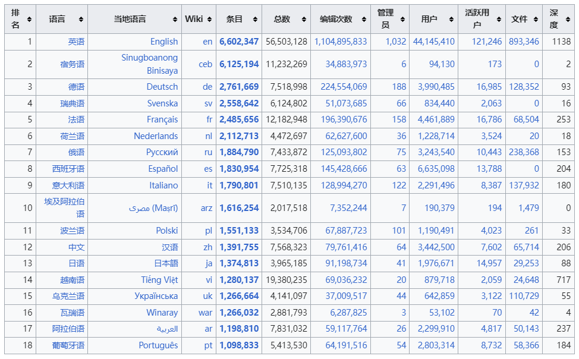

最近在听Podcast中听到一个信息

> 在八百多年前的日本平安时代，女人是不允许学习汉字的，她们只能学习片假字，用片假字交流和学习，导致了女性在获取的信息时十分被动，难以获取到与男性相同的信息。

我立马就想到了平安时代身为女性却能写出《源氏物语》的紫部式，让我对这段信息真伪产生了质疑。但同时我也做了个假设：将平安时代日本发生的事情放到现在会怎么样？

下面是我得出的答案

_如果我们偏居一隅过分地强调自己民族的文化自信，不去主动学习英语和其他语言，我们的思想就会变得顽固，获取的信息也会十分有限，知识的更新变得缓慢，日常中文化表达进一步加强，进一步抵制外来语言文化的融合。_

为什么这么说呢？

我们在使用信息检索引擎的时候，会发现当今世界很多的核心期刊杂志、学术论文基本是都是用英文编写的，即便是非英语国家，例如日本，也尽可能地将日语转换成英文发表。如果我们看不懂英文，就无法获取最前沿的知识，无法去了解世界上正在发生的事情，只能等待别人翻译完之后再去检索、阅读，翻译时间有可能会晚于发表时间数年之久，这就产生巨大的信息滞后。况且中文在很大程度上无法确切的翻译英文的含义，就例如`paper`一词，是翻译成稿件还是文章呢？稿件显得比较粗浅、文章又显得十分正式，还不如直接使用`paper`来的准确，因此翻译中会有一些信息失真的情况，也会有翻译中不同文化背景中的俚语难以读懂的问题。

对于英文原文翻译之后所形成的中文文章，残留着许多译者的主观态度，译者的判断和逻辑。对待一件书中所讲到的事件，译者在翻译过程中，有意或无意地将其中一个褒义词替换成带有贬义色彩的词语后，整句话的意思就发生了转变，曲解了原文所要表达的含义。对待二手信息很多人难以判断其中的失真部分，有的甚至全文都在误导个体判断的方向和思维的方向，甄别信息的来源、信息的质量也是当前个体能力的一大漏洞。

在语言的表达方式上，中文跟其他语言也存在差异。比如我们喜欢将否定词放在前面“我不想xxx”，“不要xxx”等，英语也是这样，但是类似于日语中，否定词往往在句子的末尾，无论是口语还是书面表示，都需要耐心等到对方把话讲完后才能做出自己的判断。我们看到非常多的人喜欢插话、喜欢打断别人说话，无非是在听到否定之后急于表达自己的观点，却忽视了他人想表达的意思。

我也看网上很多人都在说中文有着庞大的人口基数，约占全球1/4的人口都在讲中文，应当让全世界都来说中文，而不是我们去学习英文。这种文化过度自信往往是体现在那些无知人的口中，就拿wikipedia来说，1/4人口的中文贡献了不到5%的信息，而英文则是提供了近80%的信息，更何况全世界的学术研究中心和科技突破都在英语国家，哪里来的自信仅凭借中文就能超过常春藤。（见下图）

新加坡是一个同时使用中文和英文作为官方语言的国家，新加坡总理李光耀发表过《论中国与世界》一书，书中就提到了新加坡为什么不用中文作为外交语言以及中国为什么短期内无法超越美国的原因。李光耀的核心观点就是建立在语言之上，世界范围内都以英文作为外交语言、学术语言、创新语言等等国际硬通货，需要加强英语的基础教育和广泛应用，而中文的学习成本高、国内的英文教育质量低，使得外国人很难融入中国，中国人较难感受到外部世界的变化。

去旅行的时候，看到在日本街头，很多店的招牌都会有英文，偏僻的小店里面的服务员都能跟你正常用英文交流，撇开二战后美国政府帮助日本的重建，日本的战后迅速恢复就得益于英文的普遍化。使得英文信息能迅速进入日本，并结合具体情况做出相应的行为。

所以说，一门语言就是一种思维，语言的阉割就是思维的阉割，语言的简化就是思维的弱化。即便是同一篇文章，在用中文写完后再去写一份英文版，就会发现在用中文论证时的许多逻辑漏洞。语言的软肋就是单一语言的思维逻辑偏见，我们在跨学科学习中会通过不同的学科来看待同一个问题，同样的，多种语言的学习就能造就思维逻辑的铠甲。

我引用乔治奥威尔在其作品《1984》中对“新语”一词，来作为结尾。

> 新语的基础是删除语言的多变及模糊，余下简单的二分法：冷(cold）或不冷(uncold) 而没有温暖(warm)；只有明亮(light)、 不明亮(unhight)．没有黑暗（dark)。
> 
> ...
> 
> 你难道不明白，新语的目的就是要缩小思想的范围，最后我们要使得大家不可能思想 犯罪，因为没有词汇可以表达。必须的词汇，就简化为一个词，并严格控制其含义，删除一切附带的意象，词汇越来越少，思想的范围就越来越小。没有人可以有理由或借口思想犯罪。
> 
   乔治奥威尔, 1949:《1984》[M] 2010中译本 北京十月文艺出版社