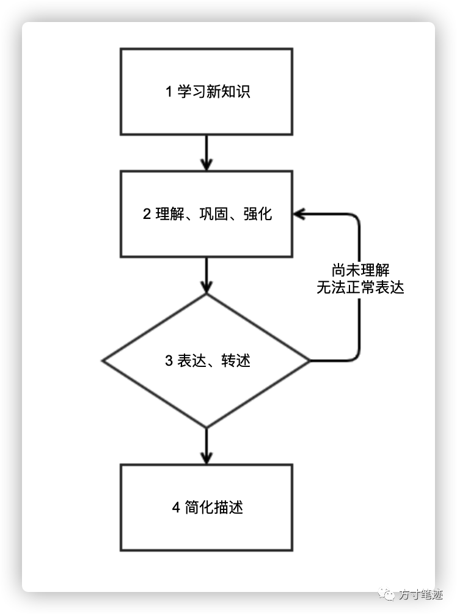

在对知识学习过程中，良好的学习方法是知识吸收程度的直接影响因素之一，在知识学习的不同层次中有非常多可供选择的学习方法，然而太多的方法因人而异，而且执行起来较为复杂。

我记得很早之前在一篇材料中读到过一个小故事：一名村里的孩子考上了北大，有记者来采访孩子的爸爸，咨询到教育理念的时候，孩子的爸爸说：我就是一个农民，哪里有什么教育方法，都是孩子去上学我就种地，他放学之后我就当作休息一下让他把白天老师讲到的内容给我转述一遍，无法转述清楚的第二天再去问老师，这样交一份学费我也能学到东西。

其实这就是费曼学习法，自理论提出后就被广泛应用，是一种非常朴素的学习方法。故事中的父亲可能并不了解什么是费曼学习法，但就在转述的过程中，让孩子能把知识经过大脑转化一遍进行输出，就产生了十分有效的知识巩固。爱因斯坦曾说过：如果你不能简单地说清楚，那你就是还完全没弄明白。

我们来深入了解一下费曼学习法。当你打算学习一个新鲜事物的时候，你会怎么做？去图书馆寻找资料，还是去网络查找论文？用费曼学习法来描述一项新知识的学习开始，就是找一张纸写下你要学习内容的关键点，然后围绕关键点去查找资料和视频，写下新的关键点，然后将所有关键点进行连接。第二步，就是你凭借你整理下来的知识关键网络，去复述给别人听。第三步，是把你在复述过程中没有说清楚的内容进行重复学习，直到能清晰地表达出来。第四步，把书本中非常专业的术语和学术内容，用白话和类比的方式进行表达转述。这时整个费曼学习法对于某一概念的学习过程已经结束（见图1）。

图1 - 费曼学习法过程  

费曼学习法之所以有效，从浅层来讲，是知识彻底在学习者大脑中进行了一遍输入和输出，而且用输出倒逼输入，更好地巩固知识和发现问题所在。从底层来讲，在学习过程中，当对新鲜事物有了一点概念上的认识之后，就产生了对事物模糊的认识，这种认识是基于学习者自身背景产生的，存在个体间的差异性，这种知识在这个阶段是无法用具像化的文字符号进行表示，这种知识又被称为隐性知识，而隐性知识存在难以纠偏的问题，因此需要学习者把隐性知识内化，然后用文字符号进行表达，这时知识就转变为了显性知识，显性知识是可以被传播的，同时也能发现知识转化中的问题，在隐性知识显性化过程中，学习者会不断地去寻找能佐证的知识点，来加强对知识的进一步巩固。

关于知识转化过程，后面我也会新写一篇推文介绍知识管理领域中的SECI螺旋模型。  

方寸笔迹设计的初衷是为了学习者更好地记忆，我们把各种学习方法同知识创造、知识管理、大脑遗忘规律、知识图谱进行融合，建立了独立的一套笔记记录方式。

首先费曼学习法所需要的是快速地知识记录，在查找过程中快速记录下相关关键点，让大脑有初步的认识，方寸笔迹提供了浏览器插件、微信端的快速记录，同时也提供微信语音转为文字录入、图片文字识别的功能，以最快的方式做好知识的积累。

在费曼学习法的对知识的进一步学习中，在对笔记内容进行修改、编辑的方式丰富时，方寸笔迹提供了标签化索引方式，找出笔记中的关键词，建立起笔记的关键词快速检索方式；对于那些不便于修改的内容，方寸笔迹提供了对原文引用的功能，作为原始内容的点评和补充。

方寸笔迹同时还能以知识图谱的方式将笔迹知识进行显现化呈现，以及在下个月推出的团队版中，能更有效地实践费曼学习法的更深层的意义。  

**Reference**  

-   龙盛明. 迁移学习问题与方法研究\[D\], 博士学位论文. 2014. 清华大学计算机学院.
    
-   吴玉辉. 费曼学习法在材料科学教学中的应用探索\[J\]. 创新教育. 2019(19).
    
-   张雷,蔡彬卓,邓欢,李行.  费曼学习技巧在自然科学基础物理部分中的教学实践\[J\]. 大学教育. 2020.08.
    
-   高光敏. 美国的“小先生”制 -- 费曼学习法\[J\]. 
    
-   野中郁次郎. 企业知识的创造\[M\]. 人民邮电出版社中译版. 2019年9月第1版.