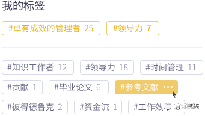
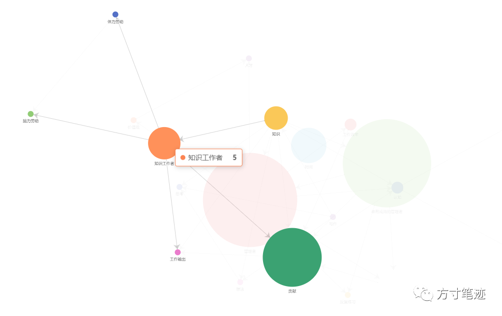

Hello各位好，方寸笔迹（Thought Note）终于能跟大家见面了。虽然还处在测试阶段，还请大家多多包涵，我们也会提供许多福利。  

方寸笔迹是一套知识管理工具，以学术界 Knowledge-Creating（知识创造）理论和组织学习（Organizational Learning）作为背景，融合了管理学的方法，以及工作学习中的感悟，所创造的一种集成了知识存储、转化、分享的产品。

我们面对现在所处的微量信息时代，需要处理大量碎片化信息，对信息的管理和知识的转化具有极强的需求，我们最缺的不是如何获取信息，有价值的信息沉淀下来才是真正的知识，所以我们需要在各种各样的信息推荐引擎中抽身逃离出来，记录信息、形成思考、转化成知识、组建成结构。所以，方寸笔迹在产品的设计理念上秉承 **快记录、慢管理** 的理念。让用户能在在碎片化中获取到信息时迅速地记录下来。然后在空闲的时间形成对信息的组织管理，进一步把信息转换成知识形成文章和记忆，不必再把冗杂的信息记录在大脑中形成负担而无法进一步思考。

方寸笔迹提供了索引化的知识管理方式，脱离了传统笔记本的结构。对笔记中的关键词形成索引关系，建立了在笔记本归类之上的知识索引化检索结构。

  

在关键词索引之上，方寸笔迹以笔记本作为逻辑边界，形成笔记本内关键词的图谱关系。只要在笔记中存在多个关键词，就会自动创建关键词的关联，最终会以具象化可视的知识图谱的形式呈现出来。

面对极多的笔记App，为何要做方寸笔迹？

当然，我也是一名非常依赖云笔记的用户。我在使用云笔记的许多年里，体验过非常多的笔记App，令我感觉最为不适的一点，就是写笔记的时候要写标题。因为我做笔记，一般都是对内容的摘录和一些碎片的思考，比如在听播客时的随笔、看NewsLetter时的摘录、读书过程中的思考等等，我需要的是随手能把笔记记录下来，而不是去想标题应该怎么写。写标题这件事情不仅是增加了我的负担，而且浪费了时间。

我不否定长笔记的应用场景，长笔记一般是需要在整块完整的且不会被打扰的时间段内，专注于写作和思考，进行文字的整理和思考的导出，所以长笔记App会带有非常复杂的文字编辑操作、格式的限定等等，这一点在我写文章时就会非常有用。但归其根本，长篇的文献也必然不是一蹴而就的，没有大量的知识吸收是无法完成的。在知识的获取阶段中，就需要有一个趁手的、方便的积累工具，积累学习中的思考与引用，逐渐形成体系化的思考。

日常中的许多事情，确实是需要我们来努力工作努力学习，但也需要有方法来指导才会不至于让努力白费。我相信努力的意义，我也相信方法指导的意义，两者融合才会让你的时间更有意义。我并不认为我是方寸笔迹的创始人或者开发者，我只是方寸笔迹的一名用户，我是在探索知识学习的道路上受到了启发，要让这种有价值的产品给更多的人看到，能给更多需要的人使用上。很多事情都不会是一开始就能完美的，方寸笔迹也一样，现在仅仅是一个开始，是在走一百步的目标中迈出的第一步，我很高兴能走出第一步，我相信第二步第三步也会走得更加快速和踏实，我非常感谢我们团队中的每一位成员，也感谢作为用户的你所做的支持与贡献，非常感谢。

借用James Dale Davidson的一句话：一个能够独立思考的个体，会以他的心智模式或者思考模式，依赖在自己独特的知识、技能和经验的组合，建立一种以自己为中心的市场，然后通过网络把它放大。信息化会带来的整个社会结构的变化，使得知识工作者不再受到组织、时间的约束，进而发挥出知识杠杆的最大效用。在这种背景之下，财富就是信息，武器就是信息，土地也是信息；或者，反过来说也可以，信息就是财富、武器、土地 ...

如果你觉得你是知识型工作者，如果你觉得你需要对海量的信息掘金，或是你想重构自己的知识体系。我们会定期更新知识管理的技巧，欢迎体验方寸笔迹。